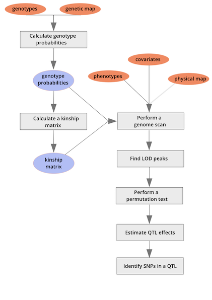

Quantitative trait mapping is used in biomedical, agricultural, and evolutionary studies to find causal genes for quantitative traits, to aid crop and breed selection in agriculture, and to shed light on natural selection. Examples of quantitative traits include cholesterol level, plant yield, or egg size, all of which are continuous variables. The goal of quantitative trait locus (QTL) analysis is to identify genomic regions linked to a phenotype, to map these regions precisely, and to define the effects, number, and interactions of QTL.
QTL analysis can be performed in natural populations or in experimental crosses, and can be studied in humans and non-human species. Human studies, however, are very expensive, lack environmental control, and can be confounded by [population structure](https://en.wikipedia.org/wiki/Population_stratification) such that associations between genotype and phenotype  are not necessarily causal.
QTL analysis in experimental crosses requires two or more strains that differ genetically with regard to a phenotype of interest. Genetic markers, such as SNPs or microsatellites, distinguish between parental strains in the experimental cross. Markers that are genetically linked to a phenotype will segregate more often with phenotype values (high or low values, for example), while unlinked markers will not be significantly associated with the phenotype. The markers themselves might be associated with the phenotype but are not causal. Rather, markers may be associated with the phenotype through linkage to nearby QTL. They serve as signposts indicating the neighborhood of a QTL that influences a phenotype. Covariates such as sex
or diet can also influence the phenotype.

[R/qtl2](http://kbroman.org/qtl2) (aka qtl2) is a reimplementation of the QTL analysis software
[R/qtl](http://rqtl.org), to better handle high-dimensional data
and complex cross designs such as the Diversity Outbred. Typically R/qtl2 will be employed in "batch" (for example, on a cluster) rather than interactively. 

This lesson will focus on the R/qtl2 package in R. A workflow for quantitative trait mapping with R/qtl2 is shown here.

We will follow the workflow throughout this lesson using [sample input data files](http://kbroman.org/qtl2/pages/sampledata.html) built into R/qtl2, as well as data from published studies of Diversity Outbred (DO) mice ([Recla et al., 2014](https://www.ncbi.nlm.nih.gov/pmc/articles/PMC4032469/) and [French et al., 2015](https://ehp.niehs.nih.gov/1408202/)). We begin with an exploration of [input file format](http://kbroman.org/qtl2/assets/vignettes/input_files.html) requirements for R/qtl2.

To cite R/qtl in publications, use
Broman KW, Wu H, Sen S, Churchill GA (2003) R/qtl: QTL mapping
in experimental crosses. Bioinformatics 19:889-89

