Hypertension, or high blood pressure, affects more than one-fourth of the U.S. population and is a leading cause of heart attack and stroke. Hypertension is complex, is influenced by many genes, and is exacerbated by elevated sodium intake among other environmental and lifestyle factors. [Sugiyama et al. 2001](https://www.researchgate.net/profile/Gary_Churchill/publication/222549548_Concordance_of_Murine_Quantitative_Trait_Loci_for_Salt-Induced_Hypertension_with_Rat_and_Human_Loci/links/569e1e7c08ae00e5c9913d33.pdf) investigated the genetics of salt-induced hypertension. 250 male mice from a reciprocal backcross between salt-sensitive C57BL/6J and resistant A/J strains were treated with a 1% salt solution in drinking water. QTL analysis identified 6 loci contributing to variation in hypertension. 

Data for this study are included in the `qtl` package. To access the data and perform QTL analysis, first load the `qtl` library, then use the `data` function to load the built-in dataset. Once the data are loaded, we'll begin exploration of the data and the capabilities of the `qtl` package.

~~~
library(qtl)
data(hyper)
~~~
{: .r}

## Data exploration
Use `ls` to list the components of the data set now that they are loaded into your environment. Alternatively, you can view them in the `Environment` panel in RStudio. `?hyper` will bring you to the documentation describing these data.

~~~
ls()
~~~
{: .r}

~~~
[1] "x" "y"
~~~
{: .output}

~~~
?hyper
~~~
{: .r}

The `summary` function prints summary information about the data set. 

~~~
summary(hyper)
~~~
{: .r}

~~~
    Backcross

    No. individuals:    250 

    No. phenotypes:     2 
    Percent phenotyped: 100 100 

    No. chromosomes:    20 
        Autosomes:      1 2 3 4 5 6 7 8 9 10 11 12 13 14 15 16 17 18 19 
        X chr:          X 

    Total markers:      174 
    No. markers:        22 8 6 20 14 11 7 6 5 5 14 5 5 5 11 6 12 4 4 4 
    Percent genotyped:  47.7 
    Genotypes (%):    
          Autosomes:    BB:50.1  BA:49.9 
       X chromosome:    BY:53.0  AY:47.0 
~~~
{: .output}

Several other functions provide specific information about the data, such as the number of phenotypes, individuals, chromosomes, and markers. 

~~~
nind(hyper)
~~~
{: .r}

~~~
[1] 250
~~~
{: .output}

~~~
nphe(hyper)
~~~
{: .r}

~~~
[1] 2
~~~
{: .output}

~~~
nchr(hyper)
~~~
{: .r}

~~~
[1] 20
~~~
{: .output}

~~~
totmar(hyper)
~~~
{: .r}

~~~
[1] 174
~~~
{: .output}

~~~
nmar(hyper)
~~~
{: .r}

~~~
 1  2  3  4  5  6  7  8  9 10 11 12 13 14 15 16 17 18 19  X 
22  8  6 20 14 11  7  6  5  5 14  5  5  5 11  6 12  4  4  4 
~~~
{: .output}

Plot a summary of these data.

~~~
plot(hyper)
~~~
{: .r}

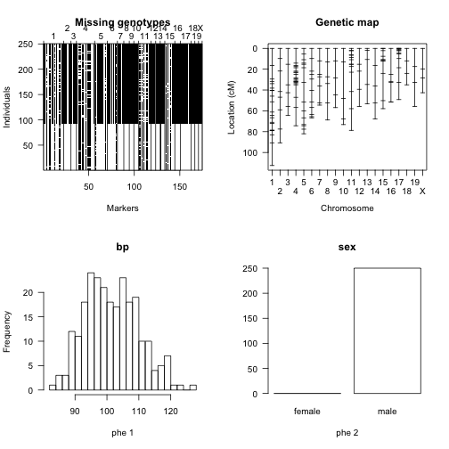

Let's look at each panel individually, starting with missing genotypes.

~~~
plotMissing(hyper)
~~~
{: .r}

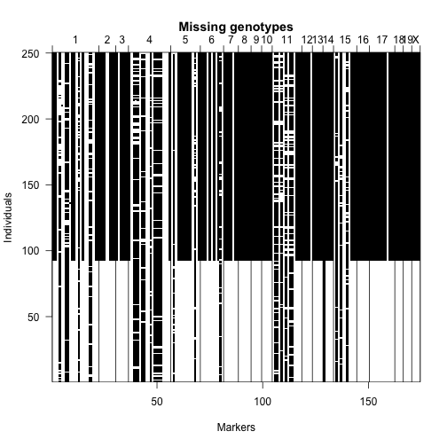

In the upper left, black pixels indicate missing genotype data. Can you find the one marker that has no genotype data? Notice that fewer than 100 individuals were genotyped for most of the markers. 

Now let's view a genetic map of the markers. 

~~~
plotMap(hyper)
~~~
{: .r}

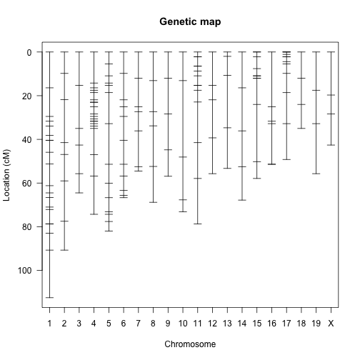

Notice that on some chromosomes, such as 18 and 19, there are very few markers. Others, like chromosome 4, have many more markers. This study was published in 2001 when genotyping many markers was relatively expensive. At present we expect much greater marker density and far more genotyping. Nevertheless a sparse genetic map like this serves to teach concepts that we need to understand for denser genotyping data.

Plot the missing data again, re-ordering the individuals according to the value of the blood pressure phenotype.

~~~
plotMissing(hyper, reorder=TRUE)
~~~
{: .r}

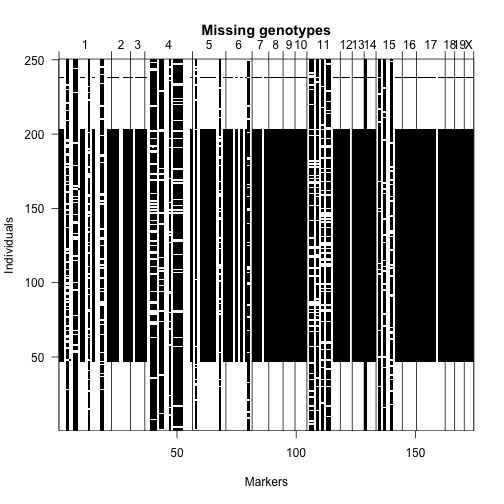

For most markers, only individuals with extreme phenotypes were genotyped. At many markers (in regions of interest), markers were typed only on recombinant individuals.

We can also view a histogram of the blood pressure phenotype, as well as a chart indicating the number of animals of each sex.

~~~
plotPheno(hyper, pheno.col = 1)
~~~
{: .r}

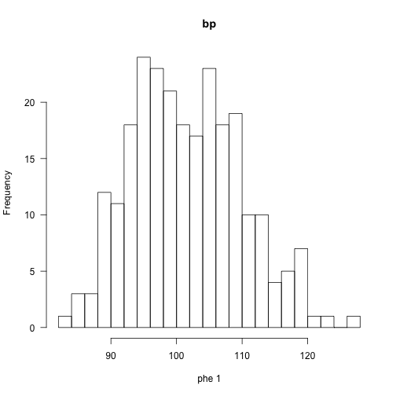

~~~
plotPheno(hyper, pheno.col = 2)
~~~
{: .r}

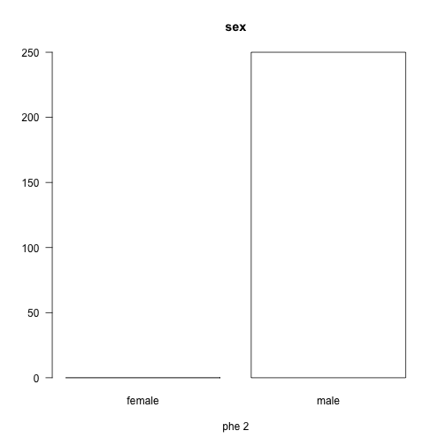

> ## Challenge 1
>
> The R/qtl package includes data on susceptibility to 
> *Listeria monocytogenes* in mice from 
> [Boyartchuk et al., Nature Genetics 27:259-260, 2001](https://search.proquest.com/openview/34242da571de16c0912dc6bed9db8dee/1?pq-origsite=gscholar&cbl=33429).
> The phenotype is survival time in hours following *Listeria* 
> infection. A survival time of 264 hours indicates those 
> animals that recovered from the infection.
>
> Access the data with `data(listeria)` and view summaries.
> 1). What type of cross is this?
> 2). How many animals are there? How many of each sex?
> 3). How many markers are there?
> 4). Does survival time (T264) appear to be normally distributed?
> > ## Solution to Challenge 1
> >
> > 
> > ~~~
> > data(listeria)
> > summary(listeria)
> > ~~~
> > {: .r}
> > 
> > 
> > 
> > ~~~
> >     F2 intercross
> > 
> >     No. individuals:    120 
> > 
> >     No. phenotypes:     2 
> >     Percent phenotyped: 96.7 100 
> > 
> >     No. chromosomes:    20 
> >         Autosomes:      1 2 3 4 5 6 7 8 9 10 11 12 13 14 15 16 17 18 19 
> >         X chr:          X 
> > 
> >     Total markers:      133 
> >     No. markers:        13 6 6 4 13 13 6 6 7 5 6 6 12 4 8 4 4 4 4 2 
> >     Percent genotyped:  88.5 
> >     Genotypes (%):    
> >           Autosomes:        CC:25.8      CB:48.9      BB:24.4  not BB:0.0  
> >                         not CC:0.9  
> >        X chromosome:        CC:51.7      CB:48.3 
> > ~~~
> > {: .output}
> > 
> > 
> > 
> > ~~~
> > plot(listeria)
> > ~~~
> > {: .r}
> > 
> > 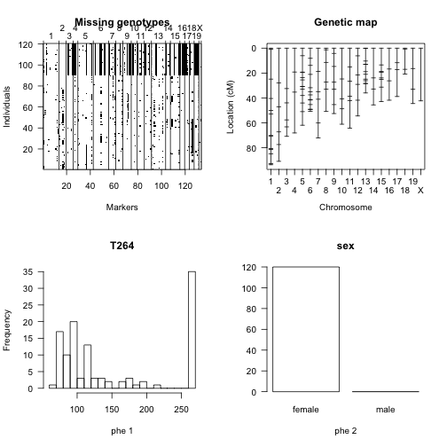
> > 
> > ~~~
> > plotMissing(listeria)
> > ~~~
> > {: .r}
> > 
> > 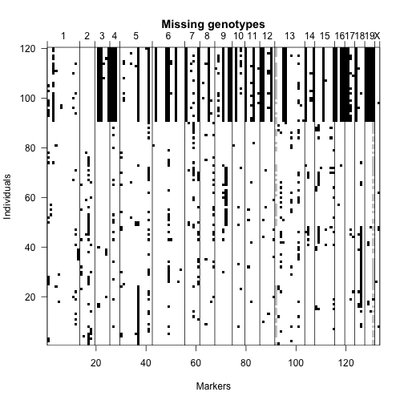
> > 
> > ~~~
> > plotPheno(listeria, pheno.col = 1)
> > ~~~
> > {: .r}
> > 
> > 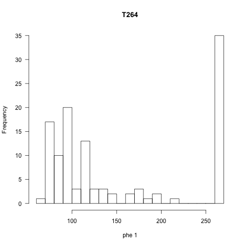
> > 
> > ~~~
> > plotPheno(listeria, pheno.col = 2)
> > ~~~
> > {: .r}
> > 
> > 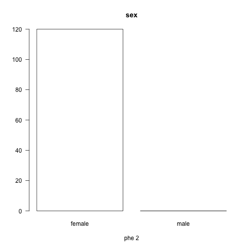
> > This is an F2 intercross consisting of 120 female animals and 
> > no males. There are 133 genotyped markers. Survival time
> > is not normally distributed, but rather appears to be 
> > bimodal with many animals surviving for 264 days, while
> > most animals survived fewer than 150 days.
> {: .solution}
{: .challenge}

## Single-QTL genome scan
We now, finally, get to QTL mapping. The core of R/qtl is a set of functions which use hidden Markov models to calculate QTL genotype probabilities, to simulate from the joint genotype distribution and to calculate the most likely sequence of underlying genotypes (all conditional on the observed marker data). This is done in a quite general way, with possible allowance for the presence of genotyping errors. Of course, for convenience we assume no crossover interference.

The function `calc.genoprob` calculates QTL genotype probabilities, conditional on the available marker data. These are needed for most of the QTL mapping functions. The argument `step` indicates the step size (in cM) at which the probabilities are calculated, and determines the step size at which later LOD scores are calculated. The argument `error.prob` is an assumed genotyping error rate.

~~~
hyper <- calc.genoprob(hyper, step=1, error.prob=0.01)
~~~
{: .r}

We may now use the function `scanone` to perform a single-QTL genome scan with a normal model. We may use maximum likelihood via the Expectation-Maximization (EM) algorithm as in [Lander and Botstein 1989](https://www.ncbi.nlm.nih.gov/pmc/articles/PMC1203601/pdf/ge1211185.pdf) to carry out a hypothesis test for each putative QTL position in the genome. Our null hypothesis states that there is no QTL anywhere in the genome. The EM algorithm produces a logarithm-of-odds (LOD) score of the alternative hypothesis (that there is a QTL linked to the position) against the null hypothesis. The greater the LOD score, the higher the likelihood that a QTL is present at the position.

Where marker density is relatively high, [Haley-Knott regression](http://animalscience2.ucdavis.edu/ggg201d/references/pdf_files/haley_knott_1992.pdf) produces faster and similarly accurate results when compared to the EM algorithm. The conditional genotype probabilities calculated by the `calc.genoprob` function are used in a linear regression of the phenotype on the genotype probabilities. 

We'll compare results of the EM algorithm and Haley-Knott regression on the `hyper` data. We already know that in many cases only animals with extreme phenotypes were genotyped, so we might expect EM to perform better. 

~~~
out.em <- scanone(hyper)
out.hk <- scanone(hyper, method="hk")
~~~
{: .r}

The output of scanone has class `scanone`; the function `summary.scanone` displays the maximum LOD score on each chromosome for which the LOD exceeds a specified threshold.

~~~
summary(out.em)
~~~
{: .r}

~~~
          chr  pos   lod
c1.loc45    1 48.3 3.515
c2.loc45    2 52.7 1.604
c3.loc32    3 34.2 0.748
D4Mit164    4 29.5 8.023
c5.loc72    5 72.0 1.504
c6.loc24    6 24.0 1.928
D7Mit297    7 26.2 0.390
D8Mit271    8 59.0 0.782
D9Mit18     9 68.9 0.740
c10.loc8   10 10.2 0.261
c11.loc37  11 39.2 0.649
D12Mit37   12  1.1 0.410
D13Mit78   13 59.0 0.307
D14Mit7    14 52.5 0.121
c15.loc14  15 19.5 1.765
D16Mit70   16 51.4 0.370
D17Mit46   17  3.3 0.209
c18.loc12  18 14.2 0.428
D19Mit59   19  0.0 0.768
cX.loc38    X 39.1 1.001
~~~
{: .output}

~~~
summary(out.em, threshold=3)
~~~
{: .r}

~~~
         chr  pos  lod
c1.loc45   1 48.3 3.52
D4Mit164   4 29.5 8.02
~~~
{: .output}

~~~
summary(out.hk, threshold=3)
~~~
{: .r}

~~~
         chr  pos  lod
c1.loc45   1 48.3 3.55
D4Mit164   4 29.5 8.09
~~~
{: .output}

The function `max.scanone` returns just the highest peak from output of `scanone`.

~~~
max(out.em)
~~~
{: .r}

~~~
         chr  pos  lod
D4Mit164   4 29.5 8.02
~~~
{: .output}

~~~
max(out.hk)
~~~
{: .r}

~~~
         chr  pos  lod
D4Mit164   4 29.5 8.09
~~~
{: .output}

We may also plot the results. `plot.scanone`
can plot up to three genome scans at once, provided that they conform appropriately. Alternatively, one may use the argument `add`.

~~~
plot(out.em, chr=c(1,4,15))
~~~
{: .r}

~~~
plot(out.em, out.hk, chr=c(1,4,15))
~~~
{: .r}

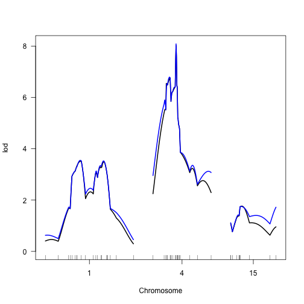

~~~
plot(out.em, chr=c(1,4,15))
plot(out.hk, chr=c(1,4,15), col="blue", add=TRUE)
~~~
{: .r}

The function `scanone` may also be used to perform a permutation test to get a genome-wide LOD significance threshold. For Haley-Knott regression, this can be quite fast.

~~~
operm.hk <- scanone(hyper, method="hk", n.perm=1000)
~~~
{: .r}

~~~
Doing permutation in batch mode ...
~~~
{: .output}

The permutation output has class `scanoneperm`. The function `summary.scanoneperm` can be used to get
significance thresholds.

~~~
summary(operm.hk, alpha=0.05)
~~~
{: .r}

~~~
LOD thresholds (1000 permutations)
    lod
5% 2.75
~~~
{: .output}

In addition, if the permutations results are included in a call to `summary.scanone`, you can estimate genome-scan-adjusted p-values for inferred QTL, and can get a report of all chromosomes meeting a certain significance level, with the corresponding LOD threshold calculated automatically.

~~~
summary(out.hk, perms=operm.hk, alpha=0.05, pvalues=TRUE)
~~~
{: .r}

~~~
         chr  pos  lod  pval
c1.loc45   1 48.3 3.55 0.014
D4Mit164   4 29.5 8.09 0.000
~~~
{: .output}

We can also add the significance threshold to a genome scan.

~~~
plot(out.em, chr=c(1,4,15))
add.threshold(out.em, chr=c(1,4,15), operm.hk, alpha = 0.05, col = "red", lwd = 2)
add.threshold(out.em, chr=c(1,4,15), operm.hk, alpha = 0.1, col = "blue", lwd = 2)
~~~
{: .r}

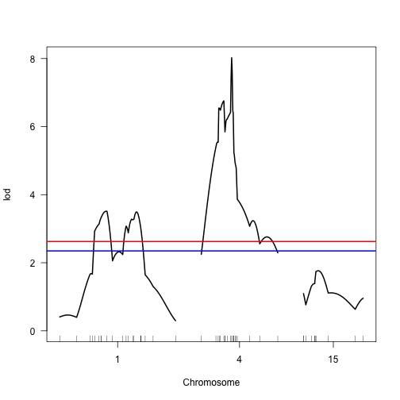

## Two-QTL genome scan
The function `scantwo` performs a two-dimensional genome scan with a two-QTL model. For every pair of positions, it calculates a LOD score for the full model (two QTL plus interaction) and a LOD score for the additive model (two QTL but no interaction). This can be quite time consuming, and so you may wish to do the calculations on a coarser grid.

~~~
hyper <- calc.genoprob(hyper, step=5, error.prob=0.01)
out2.hk <- scantwo(hyper, method="hk")
~~~
{: .r}

One can also use method="em" or method="imp", but they are even more time consuming.

The output of `scantwo` has class `scantwo`; there are functions for obtaining summaries and plots, of course.

The summary function considers each pair of chromosomes, and calculates the maximum LOD score for the full model (Mf) and the maximum LOD score for the additive model (Ma). These two models are allowed to be maximized at different positions. We further calculate a LOD score for a test of epistasis, Mi=Mf−Ma, and two LOD scores that concern evidence for a second QTL: Mfv1 is the LOD score comparing the full model to the best single-QTL model and Mav1
is the LOD score comparing the additive model to the best single-QTL model.

In the summary, we must provide five thresholds, for Mf, Mfv1, Mi, Ma, and Mav1, respectively. Call these Tf, Tfv1, Ti, Ta, and Tav1. We then report those pairs of chromosomes for which at least
one of the following holds:
7•Mf≥Tf and (Mfv1≥Tfv1 or Mi≥Ti)•Ma≥Ta and Mav1≥Tav1
The thresholds can be obtained by a permutation test (see below), but this is extremely time-consuming. For a mouse backcross, we suggest the thresholds (6.0, 4.7, 4.4, 4.7, 2.6) for the full, conditional-interactive, interaction, additive, and
conditional-additive LOD scores, respectively. For a mouse intercross, we suggest the thresholds (9.1, 7.1, 6.3, 6.3, 3.3) for the full, conditional-interactive, interaction, additive, and conditional-additive LOD scores, respectively. These were obtained by 10,000 simulations of crosses with 250 individuals, markers at a 10 cM spacing, and analysis by Haley-Knott regression.

~~~
summary(out2.hk, thresholds=c(6.0, 4.7, 4.4, 4.7, 2.6))
~~~
{: .r}

~~~
        pos1f pos2f lod.full lod.fv1 lod.int     pos1a pos2a lod.add
c1 :c4   68.3  30.0    14.13    6.51   0.225      68.3  30.0   13.90
c2 :c19  47.7   0.0     6.71    5.01   3.458      52.7   0.0    3.25
c3 :c3   37.2  42.2     6.10    5.08   0.226      37.2  42.2    5.87
c6 :c15  60.0  20.5     7.17    5.22   3.237      25.0  20.5    3.93
c9 :c18  67.0  37.2     6.31    4.79   4.083      67.0  12.2    2.23
c12:c19   1.1  40.0     6.48    4.79   4.090       1.1   0.0    2.39
        lod.av1
c1 :c4    6.288
c2 :c19   1.552
c3 :c3    4.853
c6 :c15   1.984
c9 :c18   0.708
c12:c19   0.697
~~~
{: .output}

The appropriate decision rule is not yet completely clear.  I am inclined to ignore Mi and to choose genome-wide thresholds for the other four based on a permutation, using a common significance level for all four. Mi would be ignored if we gave it a very large threshold, as follows.

~~~
summary(out2.hk, thresholds=c(6.0, 4.7, Inf, 4.7, 2.6))
~~~
{: .r}

~~~
        pos1f pos2f lod.full lod.fv1 lod.int     pos1a pos2a lod.add
c1 :c4   68.3  30.0    14.13    6.51   0.225      68.3  30.0   13.90
c2 :c19  47.7   0.0     6.71    5.01   3.458      52.7   0.0    3.25
c3 :c3   37.2  42.2     6.10    5.08   0.226      37.2  42.2    5.87
c6 :c15  60.0  20.5     7.17    5.22   3.237      25.0  20.5    3.93
c9 :c18  67.0  37.2     6.31    4.79   4.083      67.0  12.2    2.23
c12:c19   1.1  40.0     6.48    4.79   4.090       1.1   0.0    2.39
        lod.av1
c1 :c4    6.288
c2 :c19   1.552
c3 :c3    4.853
c6 :c15   1.984
c9 :c18   0.708
c12:c19   0.697
~~~
{: .output}

Plots of `scantwo` results are created via `plot.scantwo`.

~~~
plot(out2.hk)
~~~
{: .r}

~~~
plot(out2.hk, chr=c(1,4,6,15))
~~~
{: .r}

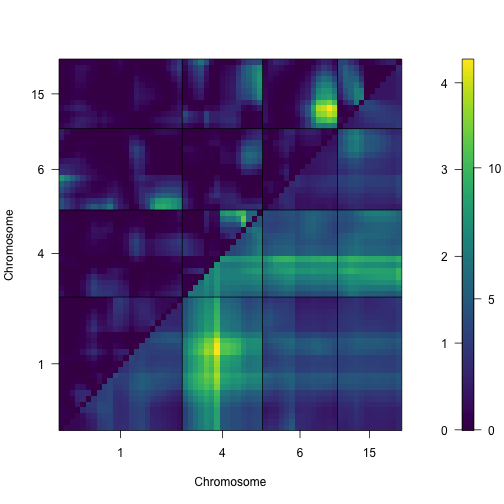

By default, the upper-left triangle contains epistasis LOD scores and the lower-right triangle contains the LOD scores for the full model. The color scale on the right indicates separate scales for the epistasis and joint LOD scores (on the left and right, respectively).

The function `max.scantwo` returns the two-locus positions with the maximum LOD score for the full and additive models.

~~~
max(out2.hk)
~~~
{: .r}

~~~
      pos1f pos2f lod.full lod.fv1 lod.int     pos1a pos2a lod.add lod.av1
c1:c4  68.3    30     14.1    6.51   0.225      68.3    30    13.9    6.29
~~~
{: .output}

One may also use `scantwo` to perform permutation tests in order to obtain genome-wide LOD significance thresholds. These can be extremely time consuming, though with the Haley-Knott regression and multiple imputation methods, there is a trick that may be used in some cases to dramatically speed things up. So we’ll try 100 permutations by the Haley-Knott regression method and hope that your computer is sufficiently fast.

~~~
operm2.hk <- scantwo(hyper, method="hk", n.perm=100)
~~~
{: .r}

~~~
Doing permutation in batch mode ...
~~~
{: .output}

We can again use `summary` to get LOD thresholds.

~~~
summary(operm2.hk)
~~~
{: .r}

~~~
bp (100 permutations)
    full  fv1  int  add  av1  one
5%  5.74 4.17 3.92 4.61 2.22 2.88
10% 5.14 3.87 3.70 4.01 2.12 2.51
~~~
{: .output}

And again these may be used in the summary of the
`scantwo` output to calculate thresholds and p-values. If you want to ignore the LOD score for the interaction in the rule about what chromosome pairs to report, give α = 0, corresponding to a threshold T=∞.

~~~
summary(out2.hk, perms=operm2.hk, pvalues=TRUE,
alphas=c(0.05, 0.05, 0, 0.05, 0.05))
~~~
{: .r}

~~~
        pos1f pos2f lod.full pval lod.fv1 pval lod.int pval     pos1a
c1 :c4   68.3  30.0    14.13 0.00    6.51 0.00   0.225 1.00      68.3
c2 :c19  47.7   0.0     6.71 0.00    5.01 0.02   3.458 0.16      52.7
c3 :c3   37.2  42.2     6.10 0.01    5.08 0.02   0.226 1.00      37.2
c6 :c15  60.0  20.5     7.17 0.00    5.22 0.02   3.237 0.26      25.0
c9 :c18  67.0  37.2     6.31 0.00    4.79 0.02   4.083 0.02      67.0
c12:c19   1.1  40.0     6.48 0.00    4.79 0.02   4.090 0.02       1.1
        pos2a lod.add pval lod.av1 pval
c1 :c4   30.0   13.90 0.00   6.288 0.00
c2 :c19   0.0    3.25 0.31   1.552 0.43
c3 :c3   42.2    5.87 0.01   4.853 0.00
c6 :c15  20.5    3.93 0.11   1.984 0.18
c9 :c18  12.2    2.23 0.81   0.708 1.00
c12:c19   0.0    2.39 0.76   0.697 1.00
~~~
{: .output}

You can’t really trust these results. Haley-Knott regression performs poorly in the case of selective genotyping (as with the hyper data). Standard interval mapping or imputation would be better, but Haley-Knott regression has the advantage of speed, which is the reason we use it here.
