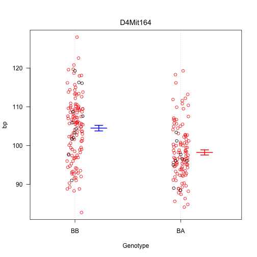
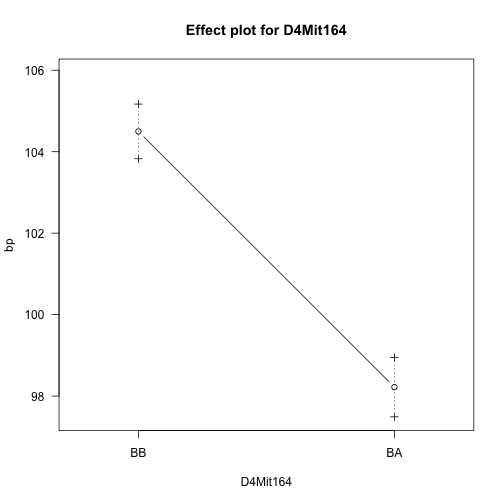
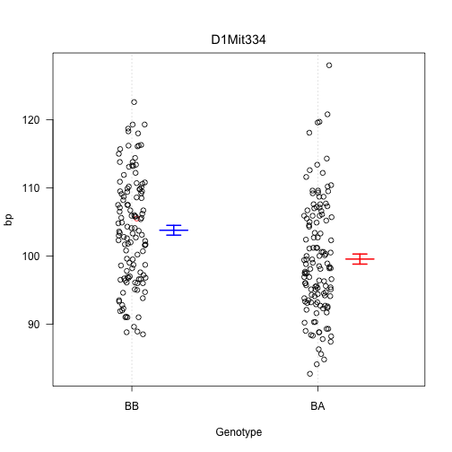
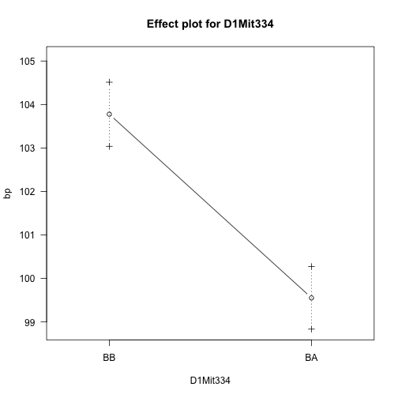
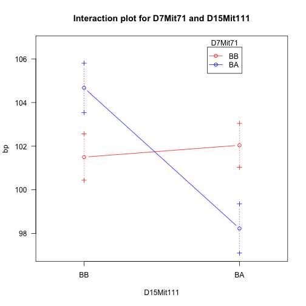
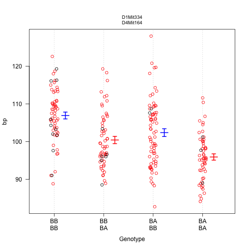
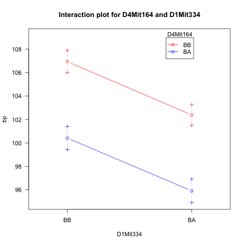
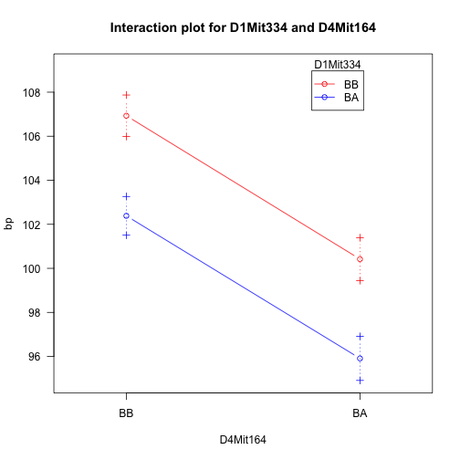

We may obtain plots indicating the estimated effects of the QTL via `plotPXG`, which creates a dot plot, or
`effectplot`, which plots the average phenotype for each genotype group.For `plotPXG`, we must first identify the marker closest to the QTL peak. Use
`find.marker`.

~~~
max(out.hk)
~~~
{: .r}

~~~
         chr  pos  lod
D4Mit164   4 29.5 8.09
~~~
{: .output}

~~~
mar <- find.marker(hyper, chr=4, pos=29.5)
plotPXG(hyper, marker=mar)
~~~
{: .r}

Note that red dots correspond to inferred genotypes (based on a single imputation).

The function `effectplot` uses the multiple imputation results from `sim.geno`.

~~~
effectplot(hyper, mname1=mar)
~~~
{: .r}

~~~
Warning in effectplot(hyper, mname1 = mar): -Running sim.geno.
~~~
{: .error}

We may use `effectplot` at a position on the “grid” between markers, using "4@29.5" to indicate the position at 29.5 cM on chr 4.

~~~
effectplot(hyper, mname1="4@29.5")
~~~
{: .r}

~~~
Warning in effectplot(hyper, mname1 = "4@29.5"): -Running sim.geno.
~~~
{: .error}

Similar plots may be obtained for the locus on chr 1.

~~~
max(out.hk, chr=1)
~~~
{: .r}

~~~
         chr  pos  lod
c1.loc45   1 48.3 3.55
~~~
{: .output}

~~~
mar2 <- find.marker(hyper, chr=1, pos=48.3)
plotPXG(hyper, marker=mar2)
~~~
{: .r}

~~~
effectplot(hyper, mname1="1@48.3")
~~~
{: .r}

~~~
Warning in effectplot(hyper, mname1 = "1@48.3"): -Running sim.geno.
~~~
{: .error}

We may plot the joint effects of the two loci via
`plotPXG` as follows:

~~~
plotPXG(hyper, marker=c(mar, mar2))
~~~
{: .r}

~~~
plotPXG(hyper, marker=c(mar2, mar))
~~~
{: .r}

The function `effectplot` gives more readable figures in this case; it’s often useful to look at it in both ways.

~~~
effectplot(hyper, mname1="4@29.5", mname2="1@48.3")
~~~
{: .r}

~~~
Warning in effectplot(hyper, mname1 = "4@29.5", mname2 = "1@48.3"): -
Running sim.geno.
~~~
{: .error}

~~~
effectplot(hyper, mname2="4@29.5", mname1="1@48.3")
~~~
{: .r}

~~~
Warning in effectplot(hyper, mname2 = "4@29.5", mname1 = "1@48.3"): -
Running sim.geno.
~~~
{: .error}

The two loci do not appear to interact.
