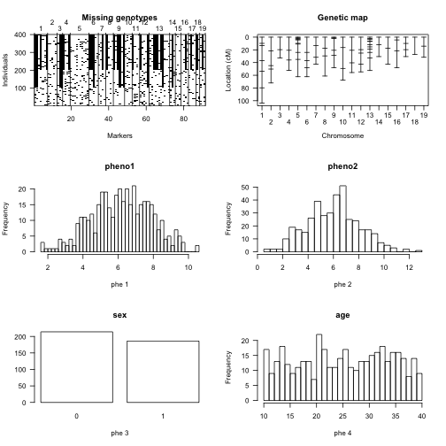
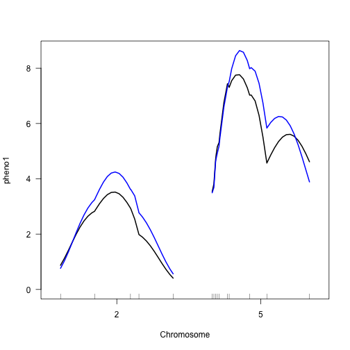
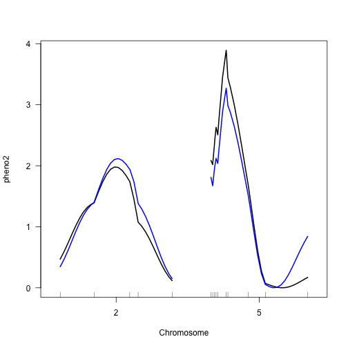
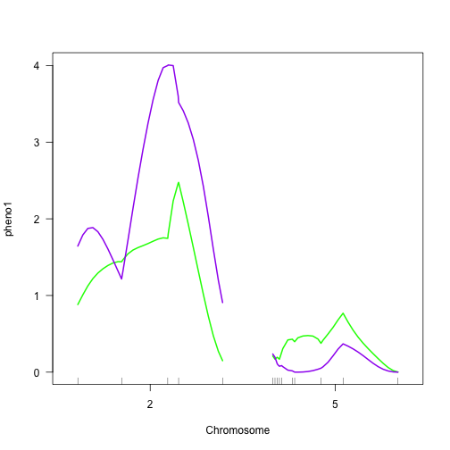

As a further example, we illustrate the use of covariates in QTL mapping. We consider some simulated backcross data.

Get access to the data.

~~~
data(fake.bc)
summary(fake.bc)
~~~
{: .r}

~~~
    Backcross

    No. individuals:    400 

    No. phenotypes:     4 
    Percent phenotyped: 100 100 100 100 

    No. chromosomes:    19 
        Autosomes:      1 2 3 4 5 6 7 8 9 10 11 12 13 14 15 16 17 18 19 

    Total markers:      91 
    No. markers:        7 5 3 4 10 5 4 4 6 4 4 5 11 3 3 4 4 2 3 
    Percent genotyped:  72.7 
    Genotypes (%):      AA:50.1  AB:49.9 
~~~
{: .output}

~~~
plot(fake.bc)
~~~
{: .r}

Perform genome scans for the two phenotypes without covariates. Here we consider two phenotypes, scanned individually.

~~~
fake.bc <- calc.genoprob(fake.bc, step=2.5)
out.nocovar <- scanone(fake.bc, pheno.col=1:2)
~~~
{: .r}

Perform genome scans with sex as an additive covariate. Note that the covariates must be numeric. Factors may have to be converted.

~~~
sex <- fake.bc$pheno$sex
out.acovar <- scanone(fake.bc, pheno.col=1:2, addcovar=sex)
~~~
{: .r}

Here, the average phenotype is allowed to be different in the two sexes, but the effect of the putative QTL is assumed to be the same in the two sexes.

Note that the use of sex as an additive covariate resulted in an increase in the LOD scores for phenotype 1, but resulted in a decreased LOD score at the chr 5 locus for phenotype 2.

~~~
summary(out.nocovar, threshold=3, format="allpeaks")
~~~
{: .r}

~~~
  chr  pos pheno1  pos pheno2
2   2 35.0   3.52 35.0   1.98
5   5 17.5   7.76  9.8   3.89
~~~
{: .output}

~~~
summary(out.acovar, threshold=3, format="allpeaks")
~~~
{: .r}

~~~
  chr  pos pheno1  pos pheno2
2   2 35.0   4.25 37.5   2.12
5   5 17.5   8.64  9.8   3.27
~~~
{: .output}

~~~
plot(out.nocovar, out.acovar, chr=c(2, 5))
~~~
{: .r}

~~~
plot(out.nocovar, out.acovar, chr=c(2, 5), lodcolumn=2)
~~~
{: .r}

Let us now perform genome scans with sex as an interactive covariate, so that the QTL is allowed to be different in the two sexes.

~~~
out.icovar <- scanone(fake.bc, pheno.col=1:2, addcovar=sex, intcovar=sex)
~~~
{: .r}

The LOD score in the output is for the comparison of the full model with terms for sex, QTL and QTL×sex interaction to the reduced model with just the sex term. Thus, the degrees of freedom associated with the LOD score is 2 rather than 1, and so larger LOD scores will generally be obtained.

~~~
summary(out.icovar, threshold=3, format="allpeaks")
~~~
{: .r}

~~~
  chr  pos pheno1  pos pheno2
2   2 35.0   5.92 42.5   5.99
5   5 17.5   9.11  9.8   3.29
~~~
{: .output}

~~~
plot(out.acovar, out.icovar, chr=c(2,5), col=c("blue", "red"))
~~~
{: .r}

~~~
plot(out.acovar, out.icovar, chr=c(2,5), lodcolumn=2, col=c("blue", "red"))
~~~
{: .r}

The difference between the LOD score with sex as an interactive covariate and the LOD score with sex as an additive covariate concerns the test of the QTL
× sex interaction: does the QTL have the same effect in both sexes? The differences, and a plot of the differences, may be obtained as follows.

~~~
out.sexint <- out.icovar - out.acovar
plot(out.sexint, lodcolumn=1:2, chr=c(2,5), col=c("green", "purple"))
~~~
{: .r}

The green and purple curves are for the first and second phenotypes, respectively.

To test for the QTL × sex interaction, we may perform a permutation test. This is not perfect, as the permutation test eliminates the effect of the QTL, and so we must assume that the distribution of the LOD score for the QTL × sex interaction is the same in the presence of a QTL as under the global null hypothesis of no QTL effect.

The permutation test requires some care. We must perform separate permutations with sex as an additive covariate and with sex as an interactive covariate, but we must ensure, by setting the “seed” for the random number generator, that they use matched permutations of the data. For the sake of speed, we will use Haley-Knott regression, even though the results above were obtained by standard interval mapping. Also, we will perform just 100 permutations, though 1000 would be preferred.

~~~
seed <- ceiling(runif(1, 0, 10^8))
set.seed(seed)
operm.acovar <- scanone(fake.bc, pheno.col=1:2, addcovar=sex, method="hk", n.perm=100)
~~~
{: .r}

~~~
Permutation 5 
Permutation 10 
Permutation 15 
Permutation 20 
Permutation 25 
Permutation 30 
Permutation 35 
Permutation 40 
Permutation 45 
Permutation 50 
Permutation 55 
Permutation 60 
Permutation 65 
Permutation 70 
Permutation 75 
Permutation 80 
Permutation 85 
Permutation 90 
Permutation 95 
Permutation 100 
~~~
{: .output}

~~~
set.seed(seed)
operm.icovar <- scanone(fake.bc, pheno.col=1:2, addcovar=sex,
intcovar=sex, method="hk", n.perm=100)
~~~
{: .r}

~~~
Permutation 5 
Permutation 10 
Permutation 15 
Permutation 20 
Permutation 25 
Permutation 30 
Permutation 35 
Permutation 40 
Permutation 45 
Permutation 50 
Permutation 55 
Permutation 60 
Permutation 65 
Permutation 70 
Permutation 75 
Permutation 80 
Permutation 85 
Permutation 90 
Permutation 95 
Permutation 100 
~~~
{: .output}

Again, the differences concern the QTL×sex interaction.

~~~
operm.sexint <- operm.icovar - operm.acovar
~~~
{: .r}

We can use `summary` to get the genome-wide LOD thresholds.

~~~
summary(operm.sexint, alpha=c(0.05, 0.20))
~~~
{: .r}

~~~
LOD thresholds (100 permutations)
    pheno1 pheno2
5%    1.68   1.52
20%   1.01   0.96
~~~
{: .output}

We can also use these results to look at evidence for QTL×sex interaction in our initial scans.

~~~
summary(out.sexint, perms=operm.sexint, alpha=0.1,format="allpeaks", pvalues=TRUE)
~~~
{: .r}

~~~
   chr  pos pheno1 pval  pos pheno2 pval
2    2 50.2 2.4754 0.01 45.0  4.007 0.00
7    7 42.6 0.0322 0.90 42.6  1.913 0.01
17  17  9.9 1.7762 0.04  9.9  0.776 0.29
~~~
{: .output}
