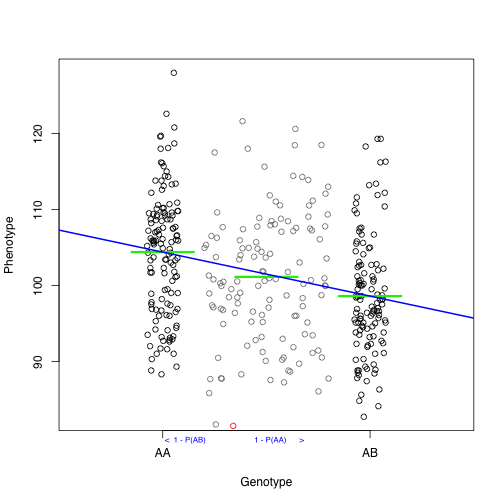

Regress the phenotypes on the conditional genotype probabilities (conditional on known marker genotypes)

~~~
library(qtl)
data(hyper)
x <- pull.geno(hyper)[,"D4Mit214"]
u <- runif(length(x), -0.075, 0.075)
y <- hyper$pheno[,1]
me <- tapply(y, x, mean)
fake <- rnorm(125, mean=101.6116, sd = 8.423751)
par(family = "sans")
plot(y ~ x, type="n", xlab="Genotype", ylab="Phenotype", xlim=c(0.5,2.5), xaxs="i", xaxt="n")
axis(side=1, at=1:2, labels=c("AA","AB"))
points(x+u, y)
segments((1:2)-0.15, me, (1:2)+0.15, me, lwd=3, col="green2")
points(1.5+(4*u[1:125]), fake, col="gray50")
segments(1.35, mean(fake), 1.65, mean(fake), lwd=3, col="green2")
points(1.34, 81.5, col="red")
mtext(" <  1 - P(AB)", 1, at = 1, adj = 0, cex=0.65, col = "blue")
mtext("    1 - P(AA)      >", 1, at = 1.4, adj = 0, cex=0.65, col = "blue")
abline(lm(y~x)$coef, col="blue", lwd=2)
~~~
{: .r}

To perform a genome scan by Haley-Knott regression
([Haley and Knott 1992](https://www.ncbi.nlm.nih.gov/pubmed/16718932)),
use the function `scan1()` in
[qtl2scan](https://github.com/rqtl/qtl2scan). (The previous functions 
were all from [qtl2geno](https://github.com/rqtl/qtl2geno); from here
forward, the functions are all from
[qtl2scan](https://github.com/rqtl/qtl2scan).)

`scan1()` takes as input the genotype probabilities, a matrix of phenotypes, and then optional additive and interactive covariates, and the special X chromosome covariates. Another option is to provide a
vector of weights.

~~~
library(qtl2scan)
out <- scan1(pr, iron$pheno, Xcovar=Xcovar)
~~~
{: .r}

On a multi-core machine, you can get some speed-up via the `cores` argument, as with `calc_genoprob()` and `calc_kinship()`.

~~~
out <- scan1(pr, iron$pheno, Xcovar=Xcovar, cores=4)
~~~
{: .r}

The output of `scan1()` is a matrix of LOD scores, positions &times; phenotypes. (Well, actually, the output is a list including `"lod"` which is this matrix of LOD scores, but also including the
genetic map and other details.)

The function `plot_scan1()` in the
[qtl2plot](https://github.com/rqtl/qtl2plot) package can be used to plot the LOD curves. You can just write `plot()`, as there's an S3 method `plot.scan1()` and the output of `scan1()` has class `"scan1"`.

Use the argument `lodcolumn` to indicate which column to plot. Unlike the `plot.scanone()` function in [R/qtl](http://rqtl.org), the `plot_scan1()` function will only plot one set of LOD curves at a time, and you need to provide the marker/pseudomarker map (created by `insert_pseudomarkers()`).

~~~
library(qtl2plot)
par(mar=c(5.1, 4.1, 1.1, 1.1))
ymx <- maxlod(out) # overall maximum LOD score
plot(out, map, lodcolumn=1, col="slateblue", ylim=c(0, ymx*1.02))
plot(out, map, lodcolumn=2, col="violetred", add=TRUE)
legend("topleft", lwd=2, col=c("slateblue", "violetred"), colnames(out), bg="gray90")
~~~
{: .r}

