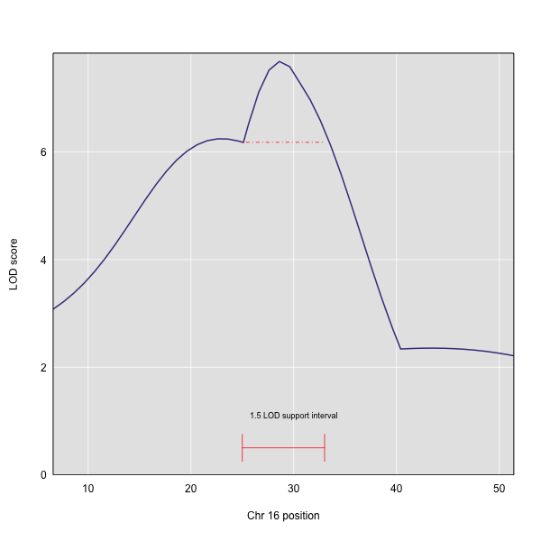

Once we have LOD scores from a genome scan, we can look for QTL affecting the phenotype. High LOD scores indicate the neighborhood of a QTL but don't give its precise position. To find the exact position of a QTL, we define an interval that is likely to hold the QTL.

We'll use two methods for defining this interval: 1) the LOD support interval; and 2) the Bayesian credible interval.

LOD support intervals are defined by the drop from the maximum LOD score. A 1.5 LOD support interval, for example, would encompass the range of map positions between maximum LOD minus 1.5. For the chromosome 16 peak, the maximum LOD score is 7.68. The 1.5 LOD support interval includes the range of map positions in which the LOD score is 7.68 minus 1.5 = 6.18 or greater. In the figure below, this is the interval from 25 to 33.

The Bayes credible interval is the preferred method for defining QTL intervals. It describes the probability that the interval contains the true value. Credible intervals make a probabilistic statement about the true value, for example, a 95% credible interval states that there is a 95% chance that the true value lies within the interval.

To find peaks above a given threshold LOD value, use the function `find_peaks()` in the
[qtl2scan](https://github.com/rqtl/qtl2scan) package. It can also provide LOD support or Bayes credible intervals, by using the arguments `drop` (the amount to drop in the LOD support intervals) or `prob` (the nominal coverage for the Bayes credible intervals).

You need to provide both the `scan1()` output as well as the marker/pseudomarker map.

~~~
find_peaks(out, map, threshold=4, drop=1.5)
~~~
{: .r}

~~~
  lodindex lodcolumn chr  pos       lod ci_lo ci_hi
1        1     liver   2 56.8  4.957564  48.1  73.2
2        1     liver   7 50.1  4.050766  13.1  53.6
3        1     liver  16 28.6  7.681569   6.6  40.4
4        2    spleen   8 13.6  4.302919   0.0  32.7
5        2    spleen   9 56.6 12.063226  53.6  61.2
~~~
{: .output}

The `find_peaks()` function can also pick out multiple peaks on a chromosome: each peak must exceed the chosen threshold, and the argument `peakdrop` indicates the amount that the LOD curve must drop between the lowest of two adjacent peaks.  Use this feature with caution.

~~~
find_peaks(out, map, threshold=4, peakdrop=1.8, drop=1.5)
~~~
{: .r}

~~~
  lodindex lodcolumn chr  pos       lod ci_lo ci_hi
1        1     liver   2 56.8  4.957564  48.1  73.2
2        1     liver   7 25.1  4.040021  13.1  28.4
3        1     liver   7 50.1  4.050766  31.7  53.6
4        1     liver  16 28.6  7.681569   6.6  40.4
5        2    spleen   8 13.6  4.302919   0.0  32.7
6        2    spleen   9 56.6 12.063226  53.6  61.2
~~~
{: .output}

The functions `lod_int()` and `bayes_int()` can be used to derive the LOD support or Bayes credible intervals for QTL, for a specific chromosome and LOD score column. For example, to obtain the Bayes
interval for the locus on chromosome 9 for the second phenotype ("spleen"):

~~~
bayes_int(out, map, lodcolumn=2, chr=9, prob=0.95)
~~~
{: .r}

~~~
  ci_lo  pos ci_hi
1  53.6 56.6  61.2
~~~
{: .output}

Both `lod_int()` and `bayes_int()` take a `peakdrop` argument, if you wish to try to identify multiple peaks on a chromosome. Again, use this feature with caution.

~~~
lod_int(out, map, lodcolumn=1, chr=7, peakdrop=1.8, drop=1.5)
~~~
{: .r}

~~~
  ci_lo  pos ci_hi
1  13.1 25.1  28.4
2  31.7 50.1  53.6
~~~
{: .output}

Each row is a different peak; the columns are the lower interval endpoint, the estimated QTL position, and the upper interval endpoint.

> ## Challenge 1
> Find peaks in the genome scan object called `out` that meet a threshold of 3 and are in the interval described by a 2 point LOD drop from the peak. How many peaks meet the LOD threshold of 3 and lie within the interval defined by a 2 point LOD drop from the maximum peaks on each chromosome?
>
> > ## Solution to Challenge 1
> > `find_peaks(out, map, threshold=3, drop=2)` produces 7 peaks on 6 different chromosomes that meet a LOD threshold of 3 and are within the interval defined by a 2-LOD drop from the maximum peak on each chromosome.
> {: .solution}
{: .challenge}

> ## Challenge 2
> 1). Calculate the 90% Bayes credible interval on chromosome 16 for the liver phenotype (lodcolumn = 1).
What is the range of this interval that has a 90% chance of containing the true QTL position?  
2). Calculate the 95% Bayes credible interval for the same chromosome and phenotype. How does the interval change as you increase the probability? Why?
>
> > ## Solution to Challenge 2
> >
> > 1). `bayes_int(out, map, lodcolumn=1, chr=16, prob=0.90)` produces a range from 25.1 to 40.4.  
> > 2). `bayes_int(out, map, lodcolumn=1, chr=16, prob=0.95)` produces a range from 6.6 to 40.4, which is much broader than that of a 90% probability. The interval widens because the probability that the interval contains the true QTL position has increased. 
> {: .solution}
{: .challenge}
