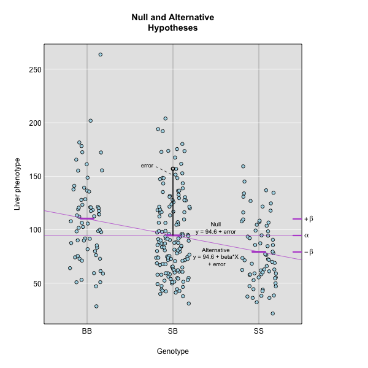
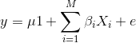
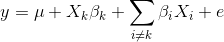
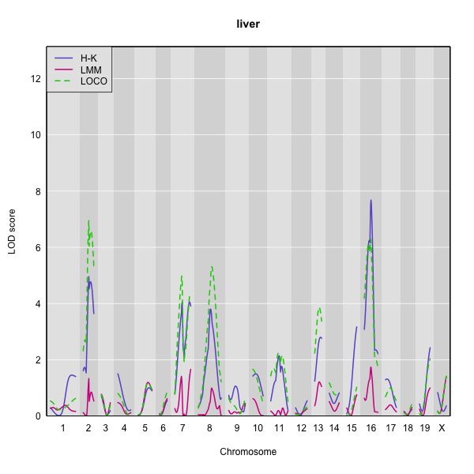
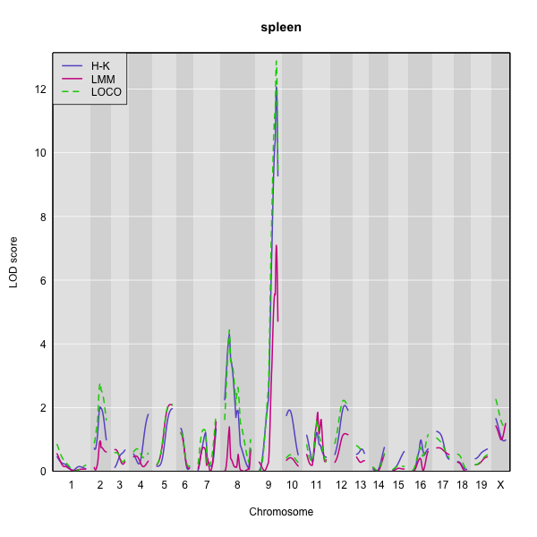

Genetic mapping in mice presents a good example of why accounting for population structure is important. Laboratory mouse strains are descended from a small number of founders (fancy mice) and went through several population bottlenecks. Wild-derived strains are not descended from fancy mice and don't share the same history as laboratory strains. Linear mixed models were developed to solve problems with population structure created by differing ancestries, and to handle relatedness between individuals.  Linear mixed models (LMMs) consider genome-wide similarity between all pairs of individuals to account for population structure, known kinship and unknown relatedness. Linear mixed models in mapping studies can successfully correct for genetic relatedness between individuals in a population by incorporating kinship into the model. Earlier we [calculated a kinship matrix](https://smcclatchy.github.io/mapping/04-calc-kinship/) for input to a linear mixed model to account for relationships among individuals. For a current review of mixed models in genetics, see this [preprint of Martin and Eskin, 2017](https://www.biorxiv.org/content/early/2017/01/28/092106).

Simple linear regression takes the form 

<i>y</i> = <i>&alpha;</i> + <i>&beta;X</i> + <i>&epsilon;</i>

which describes a line with slope &beta; and y-intercept &alpha;. The error (or residual) is represented by &epsilon;.

To model data from a cross, we use

  
 

where <i>yj</i> is the phenotype of the <i>j</i>th individual, &mu; is the mean phenotype (y-intercept), <i>&beta;k</i> is the effect of the <i>kth</i> genotype (slope), <i>Xjk</i> is the genotype for individual j, and &epsilon;j is the error for the <i>j</i>th individual. In the figure below, &mu; equals 110.2, and &beta; equals -5.8 for the alternative hypothesis (QTL exists). This linear model is <i>y</i> = 110.2 + -5.8X + &epsilon;. The model intersects the genotype groups AA and AB at their group means. In contrast, the null hypothesis would state that there is no difference in group means (no QTL anywhere). The linear model for the null hypothesis would be <i>y</i> = 101.6 + 0X + &epsilon;. This states that the phenotype is equal to the combined mean (101.6), plus some error (&epsilon;). Genotype doesn't affect the phenotype.

The linear models above describe the relationship between genotype and phenotype but are inadequate for describing the relationship between genotype and phenotype in large datasets. They don't account for relatedness among individuals. In real populations, the effect of a single genotype is influenced by many other genotypes that affect the phenotype. A  true genetic model takes into account the effect of all variants on the phenotype. 

To model the phenotypes of all individuals in the data, we can adapt the simple linear model to include all individuals and their variants so that we capture the effect of all variants shared by individuals on their phenotypes.

Now, <i>y</i> represents the phenotypes of all individuals. The effect of the <i>i</i>th genotype on the phenotype is &beta;i, the mean is &mu; times 1, (mean multiplied by a vector of 1s) and the error is &epsilon;. Here, the number of genotypes is M.

To model the effect of all genotypes and to account for relatedness, we test the effect of a single genotype while bringing all other genotypes into the model.

<i>&beta;k</i> is the effect of the genotype <i>Xk</i>, and &Sigma;i&#8800;k<i>&beta;iXi</i> sums the effects of all other genotypes except genotype k. For the leave one chromosome out (LOCO) method, <i>&beta;k</i><i>Xk</i> is the effect of genotypes on chromosome <i>k</i>, and <i>&beta;i</i><i>Xi</i> represents effect of genotypes on all other chromosomes.

 
If the sample contains divergent subpopulations, SNPs on different chromosomes will be correlated because of the  difference in allele frequencies between subpopulations caused by relatedness. To correct for correlations between chromosomes, we model all genotypes on the other chromosomes when testing for the association of a SNP. 

To perform a genome scan using a linear mixed model you also use the function `scan1`; you just need to provide the argument `kinship`, a kinship matrix (or, for the LOCO method, a list of kinship matrices).

~~~
out_pg <- scan1(pr, iron$pheno, kinship=kinship, Xcovar=Xcovar)
~~~
{: .r}

Again, on a multi-core machine, you can get some speed-up using the `cores` argument.

~~~
out_pg <- scan1(pr, iron$pheno, kinship, Xcovar=Xcovar, cores=4)
~~~
{: .r}

If, for your linear mixed model genome scan, you wish to use the "leave one chromosome out" (LOCO) method (scan each chromosome using a kinship matrix that is calculated using data from all other chromosomes), use `type="loco"` in the call to `calc_kinship()`.

~~~
kinship_loco <- calc_kinship(pr, "loco")
~~~
{: .r}

For the LOCO (leave one chromosome out) method, provide the list of kinship matrices as obtained from `calc_kinship()` with `method="loco"`.

~~~
out_pg_loco <- scan1(pr, iron$pheno, kinship_loco, Xcovar=Xcovar)
~~~
{: .r}

To plot the results, we again use `plot_scan1()`.

Here is a plot of the LOD scores by Haley-Knott regression and the linear mixed model using either the standard kinship matrix or the LOCO method.

You can use the code below to generate overlaid plots for each method.

~~~
plot_scan1(out_pg_loco, map = map, lodcolumn = "liver", col = "black")
plot_scan1(out_pg, map = map, lodcolumn = "liver", col = "blue", add = TRUE)
plot_scan1(out, map = map, lodcolumn = "liver", add = TRUE, col = "green")
~~~
{: .r}

For the liver phenotype (top panel), the three methods give quite different results. The linear mixed model with an overall kinship matrix gives much lower LOD scores than the other two methods.  On chromosomes with some evidence of a QTL, the LOCO method gives higher LOD scores than Haley-Knott, except on chromosome 16 where it gives lower LOD scores.

For the spleen phenotype (bottom panel), the linear mixed model with an overall kinship matrix again gives much lower LOD scores than the other two methods. However, in this case Haley-Knott regression and the LOCO method give quite similar results.

> ## Challenge 1
> Earlier you inserted pseudomarkers for the `grav` data and saved the results to an object called `gravmap`.  Then you calculated genotype probabilities and saved the results to an object called `gravpr`.    
> 1). Calculate kinship for the `grav` data using the LOCO method.  
> 2). Run a genome scan with the genotype probabilities and kinship that you calculated.  
> 3). Find the maximum LOD score for the scan using
`which(out_grav == maxlod(out_grav), arr.ind = TRUE)`.  
> 4). Plot the genome scan for this phenotype (hint: use the column number as lodcolumn).
> >
> > ## Solution to Challenge 1
> >
> > 1). `grav_kinship <- calc_kinship(gravpr, "loco")`
> > 2). `out_grav <- scan1(genoprobs = gravpr,
pheno = grav$pheno, kinship = grav_kinship)`
> > 3). `which(out_grav == maxlod(out_grav), arr.ind = TRUE)` row 166, col 133
> > 4). `plot(out_grav, lodcolumn = 133, map = gravmap)`
> {: .solution}
{: .challenge}

> ## Challenge 2
> What are the benefits and disadvantages of the three 
> methods for genome scanning (Haley-Knott regression,
> kinship matrix, and leave-one-chromosome out (LOCO)?)  
> Which method would you use to scan, and why?  
> Think about the advantages and disadvantages of each,
> discuss with a neighbor, and share your thoughts in the
> collaborative document.
> >
> > ## Solution to Challenge 2
> >
> {: .solution}
{: .challenge}

~~~
file <- paste0("https://raw.githubusercontent.com/rqtl/",
               "qtl2data/master/B6BTBR/b6btbr.zip")
b6btbr <- read_cross2(file)
~~~
{: .r}

> ## Challenge 3
> Pair programming exercise: with your partner, review and carry 
> out all of the steps in QTL mapping that we have covered so far,
> using a new data set. One of you types the code, the other
> explains what needs to happen next, finds the relevant code in
> the lesson, suggests new names for objects (i.e. NOT the ones
> you've already used, such as "map", "pr", "out", etc.).

> 1. Run the code above to load the [B6 x BTBR intercross data](https://github.com/rqtl/qtl2data/tree/master/B6BTBR) 
> into an object called b6btbr.
> 2. Insert pseudomarkers and calculate genotype probabilities.
> 3. Run a genome scan for the log10_insulin_10wk phenotype.
> 4. Calculate a kinship matrix.
> 5. Calculate a list of kinship matrices with the LOCO method.
> 6. Run genome scans with the regular kinship matrix and with the
> list of LOCO matrices.
> 7. Plot the 3 different genome scans in a single plot in 
> different colors.
> 8. Which chromosomes appear to have peaks with a LOD score greater than 4? 
> Which methods identify these peaks? Which don't?
> 
> >
> > ## Solution to Challenge 3
> >
> > `file <- paste0("https://raw.githubusercontent.com/rqtl/", "qtl2data/master/B6BTBR/b6btbr.zip")`  
> > `b6btbr <- read_cross2(file)`  
> > `summary(b6btbr)`  
> > `head(b6btbr$pheno)`  
> > `colnames(b6btbr$pheno)`  
> > `b6bmap <- insert_pseudomarkers(map=b6btbr$gmap, step=1)`  
> > `prb6b <- calc_genoprob(cross=b6btbr, map=b6bmap, error_prob=0.002)`  
> > `b6bXcovar <- get_x_covar(b6btbr)`  
> > `b6bout <- scan1(genoprobs = prb6b, pheno = b6btbr$pheno, Xcovar=b6bXcovar)`  
> > `plot(b6bout, map = b6bmap)`  
> > `b6bkinship <- calc_kinship(probs = prb6b)`  
> > `out_pg_b6b <- scan1(prb6b, b6btbr$pheno, kinship=b6bkinship, Xcovar=b6bXcovar)`  
> > `kinship_loco_b6b <- calc_kinship(prb6b, "loco")`  
> > `out_pg_loco_b6b <- scan1(prb6b, b6btbr$pheno, kinship_loco_b6b, Xcovar=b6bXcovar)`  
> > `plot_scan1(out_pg_loco_b6b, map = b6bmap, lodcolumn = "log10_insulin_10wk", col = "black")`  
> > `plot_scan1(out_pg_b6b, map = b6bmap, lodcolumn = "log10_insulin_10wk", col = "blue", add = TRUE)`  
> > `plot_scan1(b6bout, map = b6bmap, lodcolumn = "log10_insulin_10wk", col = "green", add = TRUE)`  
> >
> {: .solution}
{: .challenge}

