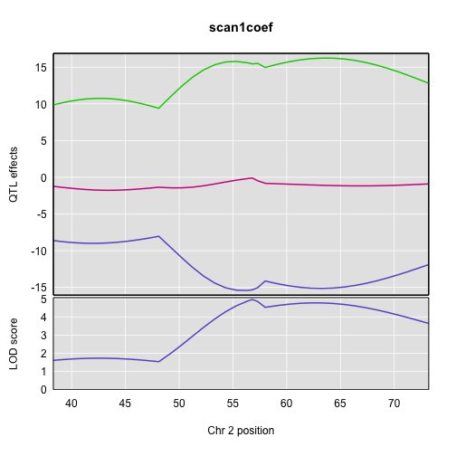
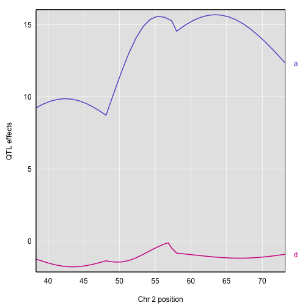
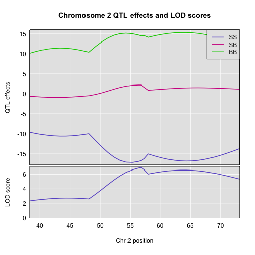
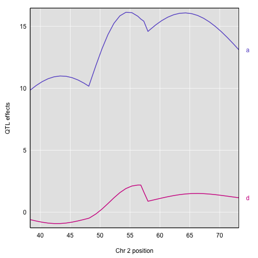
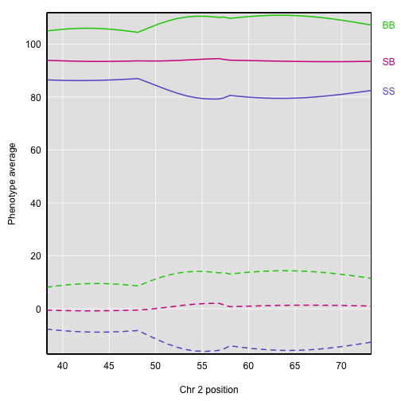
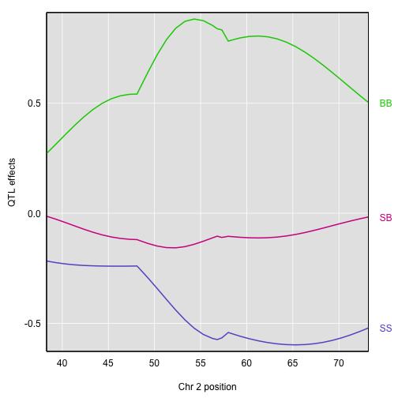
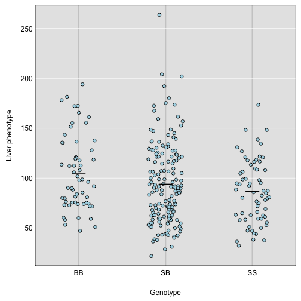
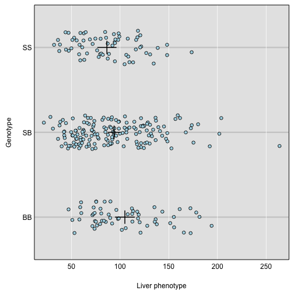

The `scan1()` function returns only LOD scores. To obtain estimated QTL effects, use the function `scan1coef()`. This function takes a single phenotype and the genotype probabilities for a single chromosome and returns a matrix with the estimated coefficients at each putative QTL location along the chromosome.

For example, to get the estimated effects on chromosome 2 for the liver phenotype, we'd do the following:

~~~
c2eff <- scan1coef(pr[,"2"], iron$pheno[,"liver"])
~~~
{: .r}

The result is a matrix of 39 positions &times; 4 genotypes. 

~~~
dim(c2eff)
~~~
{: .r}

~~~
[1] 39  4
~~~
{: .output}

~~~
head(c2eff)
~~~
{: .r}

~~~
                SS        SB        BB intercept
D2Mit379 -8.627249 -1.239968  9.867217  95.10455
c2.loc39 -8.802858 -1.405183 10.208040  95.15023
c2.loc40 -8.926486 -1.552789 10.479275  95.18752
c2.loc41 -8.994171 -1.670822 10.664993  95.21294
c2.loc42 -9.004121 -1.748738 10.752859  95.22372
c2.loc43 -8.956705 -1.779555 10.736260  95.21841
~~~
{: .output}

To plot the effects, use the function `plot_coef()`. Use the argument `columns` to indicate which coefficient columns to plot.

~~~
par(mar=c(4.1, 4.1, 1.1, 2.6), las=1)
col <- c("slateblue", "violetred", "green3")
plot(c2eff, map["2"], columns=1:3, col=col)
last_coef <- unclass(c2eff)[nrow(c2eff),] # pull out last coefficients
for(i in seq(along=last_coef))
    axis(side=4, at=last_coef[i], names(last_coef)[i], tick=FALSE, col.axis=col[i])
~~~
{: .r}

The default is to provide phenotype averages for each genotype group. If instead you want additive and dominance effects, you can provide a square matrix of _contrasts_, as follows:

~~~
c2effB <- scan1coef(pr[,"2"], iron$pheno[,"liver"],
                    contrasts=cbind(mu=c(1,1,1), a=c(-1, 0, 1), d=c(-0.5, 1, -0.5)))
~~~
{: .r}

The result will then contain the estimates of `mu`, `a`, and `d`. 

~~~
dim(c2effB)
~~~
{: .r}

~~~
[1] 39  3
~~~
{: .output}

~~~
head(c2effB)
~~~
{: .r}

~~~
               mu        a         d
D2Mit379 95.10455 9.247233 -1.239968
c2.loc39 95.15023 9.505449 -1.405183
c2.loc40 95.18752 9.702880 -1.552789
c2.loc41 95.21294 9.829582 -1.670822
c2.loc42 95.22372 9.878490 -1.748738
c2.loc43 95.21841 9.846482 -1.779555
~~~
{: .output}

Here's a plot of the additive and dominance effects, which are in the second and third columns.

~~~
par(mar=c(4.1, 4.1, 1.1, 2.6), las=1)
plot(c2effB, map["2"], columns=2:3, col=col)
last_coef <- unclass(c2effB)[nrow(c2effB),2:3] # last two coefficients
for(i in seq(along=last_coef))
    axis(side=4, at=last_coef[i], names(last_coef)[i], tick=FALSE, col.axis=col[i])
~~~
{: .r}

If you provide a kinship matrix to `scan1coef()`, it fits a linear mixed model (LMM) to account for a residual polygenic effect. Here let's use the kinship matrix from the LOCO method.

~~~
c2eff_pg <- scan1coef(pr[,"2"], iron$pheno[,"liver"], kinship_loco[["2"]])
dim(c2eff_pg)
~~~
{: .r}

~~~
[1] 39  4
~~~
{: .output}

~~~
head(c2eff_pg)
~~~
{: .r}

~~~
                 SS         SB       BB intercept
D2Mit379  -9.552159 -0.5954469 10.14761  94.54643
c2.loc39  -9.868033 -0.7068007 10.57483  94.57886
c2.loc40 -10.130889 -0.8028380 10.93373  94.60481
c2.loc41 -10.332864 -0.8737574 11.20662  94.62137
c2.loc42 -10.468249 -0.9112466 11.37950  94.62626
c2.loc43 -10.533817 -0.9103486 11.44417  94.61832
~~~
{: .output}

Here's a plot of the estimates.

~~~
par(mar=c(4.1, 4.1, 1.1, 2.6), las=1)
col <- c("slateblue", "violetred", "green3")
plot(c2eff_pg, map["2"], columns=1:3, col=col, ylab="Phenotype average")
last_coef <- unclass(c2eff_pg)[nrow(c2eff_pg),]
for(i in seq(along=last_coef))
    axis(side=4, at=last_coef[i], names(last_coef)[i], tick=FALSE, col.axis=col[i])
~~~
{: .r}

You can also get estimated additive and dominance effects, using a matrix of contrasts.

~~~
c2effB_pg <- scan1coef(pr[,"2"], iron$pheno[,"liver"], kinship_loco[["2"]],
                       contrasts=cbind(mu=c(1,1,1), a=c(-1, 0, 1), d=c(-0.5, 1, -0.5)))
~~~
{: .r}

Here's a plot of the results.

~~~
par(mar=c(4.1, 4.1, 1.1, 2.6), las=1)
plot(c2effB_pg, map["2"], columns=2:3, col=col)
last_coef <- unclass(c2effB_pg)[nrow(c2effB_pg),2:3]
for(i in seq(along=last_coef))
    axis(side=4, at=last_coef[i], names(last_coef)[i], tick=FALSE, col.axis=col[i])
~~~
{: .r}

Another option for estimating the QTL effects is to treat them as random effects and calculate Best Linear Unbiased Predictors (BLUPs). This is particularly valuable for multi-parent populations such as the Collaborative Cross and Diversity Outbred mice, where the large number of possible genotypes at a QTL lead to considerable variability in the effect estimates. To calculate BLUPs, use `scan1blup()`; it takes the same arguments as `scan1coef()`, including
the option of a kinship matrix to account for a residual polygenic effect.

~~~
c2blup <- scan1blup(pr[,"2"], iron$pheno[,"liver"], kinship_loco[["2"]])
~~~
{: .r}

Here is a plot of the BLUPs (as dashed curves) alongside the standard estimates. Note that the BLUPs are centered at 0, while the coefficient estimates are centered at the phenotype average.

~~~
par(mar=c(4.1, 4.1, 1.1, 2.6), las=1)
col <- c("slateblue", "violetred", "green3")
ylim <- range(c(c2blup, c2eff))+c(-1,1)
plot(c2eff, map["2"], columns=1:3, col=col, ylab="Phenotype average", ylim=ylim,
     xlab="Chr 2 position")
plot(c2blup, map["2"], columns=1:3, col=col, add=TRUE, lty=2)
last_coef <- unclass(c2eff)[nrow(c2eff),]
for(i in seq(along=last_coef))
    axis(side=4, at=last_coef[i], names(last_coef)[i], tick=FALSE, col.axis=col[i])
~~~
{: .r}

The `scan1coef` function can also provide estimated QTL effects for binary traits, with `model="binary"`. (However, `scan1blup` has not yet been implemented for binary traits.)

~~~
c2eff_bin <- scan1coef(pr[,"2"], bin_pheno[,"liver"], model="binary")
~~~
{: .r}

Here's a plot of the effects. They're a bit tricky to interpret, as they are basically log odds ratios.

~~~
par(mar=c(4.1, 4.1, 1.1, 2.6), las=1)
col <- c("slateblue", "violetred", "green3")
plot(c2eff_bin, map["2"], columns=1:3, col=col)
last_coef <- unclass(c2eff_bin)[nrow(c2eff_bin),] # pull out last coefficients
for(i in seq(along=last_coef))
    axis(side=4, at=last_coef[i], names(last_coef)[i], tick=FALSE, col.axis=col[i])
~~~
{: .r}

Finally, to plot the raw phenotypes against the genotypes at a single putative QTL position, you can use the function `plot_pxg()`. This takes a vector of genotypes as produced by the `maxmarg()` function, which picks the most likely genotype from a set of genotype probabilities, provided it is greater than some specified value (the argument `minprob`). Note that the “marg” in “maxmarg” stands for “marginal”, as this function is selecting the genotype at each position that has maximum marginal probability.

For example, we could get inferred genotypes at the chr 2 QTL for the liver phenotype (at 28.6 cM) as follows:

~~~
g <- maxmarg(pr, map, chr=2, pos=28.6, return_char=TRUE)
~~~
{: .r}

We use `return_char=TRUE` to have `maxmarg()` return a vector of character strings with the genotype labels.

We then plot the liver phenotype against these genotypes as follows:

~~~
par(mar=c(4.1, 4.1, 0.6, 0.6))
plot_pxg(g, iron$pheno[,"liver"], ylab="Liver phenotype")
~~~
{: .r}

We can use `swap_axes=TRUE` to have the phenotype on the x-axis. And we can use `SEmult=2` to include mean ± 2 SE intervals.

~~~
par(mar=c(4.1, 4.1, 0.6, 0.6))
plot_pxg(g, iron$pheno[,"liver"], SEmult=2, swap_axes=TRUE, xlab="Liver phenotype")
~~~
{: .r}

