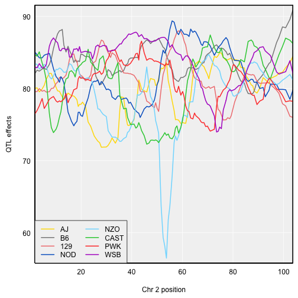
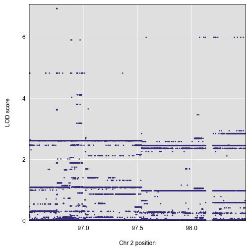
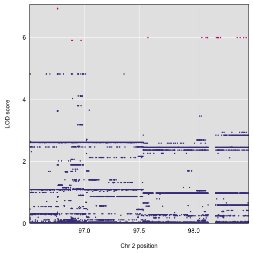

## SNP association

For multi-parent crosses, it can be useful to collapse the genotype or
allele probabilities according to the founder genotypes of the various
SNPs in the region of a QTL.

### QTL analysis in Diversity Outbred mice

To illustrate this sort of SNP association analysis, we'll consider some
Diversity Outbred mouse data. The Diversity Outcross (DO) mice are an
advanced intercross population derived from the same eight founder strains
as the Collaborative Cross (CC). See
[Svenson et al. (2012)](https://www.ncbi.nlm.nih.gov/pubmed/22345611)
and
[Gatti et al. (2014)](https://www.ncbi.nlm.nih.gov/pubmed/25237114).

We'll consider a subset of the data from
[Recla et al. (2014)](https://www.ncbi.nlm.nih.gov/pubmed/24700285),
available as part of the
[qtl2data github repository](https://github.com/rqtl/qtl2data). (The
full data are in
[`DO_Recla`](https://github.com/rqtl/qtl2data/tree/master/DO_Recla);
the directory
[`DOex`](https://github.com/rqtl/qtl2data/tree/master/DOex) contains a
reduced set, with just three chromosomes, one phenotype
(`OF_immobile_pct`, percent immobile in the open field test), and a
reduced set of markers.

You can download the data from a single zip file, as follows:

~~~
file <- paste0("https://raw.githubusercontent.com/rqtl/",
               "qtl2data/master/DOex/DOex.zip")
DOex <- read_cross2(file)
~~~
{: .r}

Let's quickly whip through a basic analysis.

We first calculate genotype probabilities and convert them to allele
probabilities. We'll just use marker locations and not insert any
pseudomarkers.

~~~
pr <- calc_genoprob(DOex, error_prob=0.002)
apr <- genoprob_to_alleleprob(pr)
~~~
{: .r}

We calculate kinship matrices (using the "loco" method, though with the
caveat that here we are only considering genotypes on three chromosomes).

~~~
k <- calc_kinship(apr, "loco")
~~~
{: .r}

We create a numeric covariate for sex; be sure to include the individual
IDs as names.

~~~
sex <- (DOex$covar$Sex == "male")*1
names(sex) <- rownames(DOex$covar)
~~~
{: .r}

We perform a genome scan with a linear mixed model (adjusting for
a residual polygenic effect), with sex as an additive covariate.

~~~
out <- scan1(apr, DOex$pheno, k, sex)
~~~
{: .r}

Here's a plot of the results.

~~~
par(mar=c(4.1, 4.1, 0.6, 0.6))
plot(out, DOex$gmap)
~~~
{: .r}

There's a strong peak on chromosome 2. Let's look at the QTL effects.
We estimate them with `scan1coef()`. We need to subset the allele
probabilities and the list of kinship matrices.

~~~
coef_c2 <- scan1coef(apr[,"2"], DOex$pheno, k[["2"]], sex)
~~~
{: .r}

For the DO, with 8 QTL alleles, we can use the function `plot_coefCC`
in the [R/qtl2plot](https://github.com/rqtl/qtl2plot) package, which
plots the 8 allele effects in the "official" Collaborative Cross (CC)
colors. (Well, actually _slightly_ modified colors, because I think the
official colors are kind of ugly.) The strong locus seems to be mostly
due to the NZO allele. Note that `CCcolors` is a vector of colors
included in the qtl2plot package; there's also a `CCorigcolors` object
with the _official_ colors.

~~~
par(mar=c(4.1, 4.1, 0.6, 0.6))
plot_coefCC(coef_c2, DOex$gmap["2"], bgcolor="gray95")
legend("bottomleft", col=CCcolors, names(CCcolors), ncol=2, lwd=2, bg="gray95")
~~~
{: .r}

### SNP associations

Okay, now finally we get to the SNP associations. We have a large peak
on chromosome 2, and we want to look at individual SNPs in the region
of the locus.

Well, actually, we first need to find the location of the inferred
QTL.  The peak LOD score on chromosome 2 occurs at
52.4 cM. But to find nearby SNPs, we really want
to know the Mbp position. The calculations were only performed at the
marker positions, and so we need to find the peak marker and then
find it's physical location:

~~~
marker <- rownames(max(out, DOex$gmap, chr="2"))
peak_Mbp <- DOex$pmap[["2"]][marker]
~~~
{: .r}

The marker is at 97.5 Mbp.

Now we need to identify the SNPs in this region. We'll focus on a 2
Mbp interval centered at 97.5 Mbp. We're still
working on how best to quickly access SNP data. In the meantime, we
can grab a predefined table of SNPs that's available in the
[qtl2data repository](https://github.com/rqtl/qtl2data). It's saved as
an RDS file, which is a slight hassle to load over the web.

~~~
tmpfile <- tempfile()
file <- "https://raw.githubusercontent.com/rqtl/qtl2data/master/DOex/c2_snpinfo.rds"
download.file(file, tmpfile, quiet=TRUE)
snpinfo <- readRDS(tmpfile)
unlink(tmpfile)
~~~
{: .r}

Here's the first few rows of the data. The columns are the SNP name,
the chromosome, the Mbp position (in Mouse genome build 38), the
alleles (with the B6 allele before the `|` and any other alleles
after; in the case of multiple alternate alleles, they are separated
by `/`). Finally, there are eight columns of genotypes for the 8 CC
founder strains, coded as `1`/`3`.

~~~
head(snpinfo)
~~~
{: .r}

~~~
       snp_id chr  pos_Mbp alleles AJ B6 129 NOD NZO CAST PWK WSB
1 rs221396738   2 96.50001     C|T  1  1   1   1   1    3   1   1
2 rs264175039   2 96.50022     A|C  1  1   1   1   3    1   1   1
3 rs227493750   2 96.50028     C|T  1  1   1   1   3    1   1   1
4 rs229722012   2 96.50034     C|G  1  1   1   1   3    3   1   3
5  rs27379137   2 96.50044     C|T  1  1   1   1   1    3   1   1
6 rs227574143   2 96.50067     A|C  1  1   1   1   3    1   1   3
~~~
{: .output}

We first convert the founder genotypes to a "strain distribution
pattern" (SDP): an integer whose binary encoding corresponds to the 8
founders' genotypes.

~~~
snpinfo$sdp <- calc_sdp(snpinfo[,-(1:4)])
~~~
{: .r}

We've added the SDP as an additional column.

~~~
head(snpinfo)
~~~
{: .r}

~~~
       snp_id chr  pos_Mbp alleles AJ B6 129 NOD NZO CAST PWK WSB sdp
1 rs221396738   2 96.50001     C|T  1  1   1   1   1    3   1   1  32
2 rs264175039   2 96.50022     A|C  1  1   1   1   3    1   1   1  16
3 rs227493750   2 96.50028     C|T  1  1   1   1   3    1   1   1  16
4 rs229722012   2 96.50034     C|G  1  1   1   1   3    3   1   3 176
5  rs27379137   2 96.50044     C|T  1  1   1   1   1    3   1   1  32
6 rs227574143   2 96.50067     A|C  1  1   1   1   3    1   1   3 144
~~~
{: .output}

(Note that there's also a function `invert_sdp()` for converting the
SDPs back into founder genotypes.)

To perform the SNP association analysis, we first use the allele
probabilities and the founder SNP genotypes to infer the SNP genotypes
for the DO mice. That is, at each SNP, we want to collapse the eight
founder allele probabilities to two SNP allele probabilities, using
the the SNP genotypes of the founders.

We do this assuming that the allele probabilities were
calculated sufficiently densely that they can be assumed to be
constant in intervals. With this assumption, we then:

- Find the interval for each SNP.
- Reduce the SNPs to a "distinct" set: if two SNPs have the same SDP
  and are in the same interval, by our assumption their allele
  probabilities will be the same.
- Take the average of the allele probabilities at the two endpoints of
  each interval.
- Collapse the 8 allele probabilities to two according to each
  observed SDP in the interval.

We further create a look-up table relating the full set of SNPs to the
reduced set (one of each observed SDP in each interval).

We first need to identify the equivalent SNPs, using the function
`index_snps()`. This requires a physical map of the
markers/pseudomarkers used to calculate the genotype probabilities.
We take this directly from the `DOex`
object, as we'd calculated the allele
probabilities only at the observed markers. If we'd also calculated
probabilities at pseudomarker positions between markers, we'd need to
use interpolation to get Mbp positions for the
pseudomarkers. There's a function `interp_map()` for assisting with
that.

The `index_snps()` function takes the physical map and the `snpinfo`
data frame, include the strain distribution patterns we calculated above.
It inserts three new columns into the data frame (`"index"`,
`"interval"`, and `"on_map"`: indexes to a set of non-equivalent SNPs,
map intervals in which the SNPs lie, and whether the SNPs correspond
to marker/pseudomarker positions).

~~~
snpinfo <- index_snps(DOex$pmap, snpinfo)
~~~
{: .r}

We can then use the function `genoprob_to_snpprob()`,
which takes the allele probabilities (or the full genotype
probabilities, if you want to use a full 3-genotype model at each
SNP), to collapse the genotype probabilities to SNP genotype
probabilities.

~~~
snp_pr <- genoprob_to_snpprob(apr, snpinfo)
~~~
{: .r}

The output of this function, `snp_pr`, has the same form as the input
`apr` object with allele probabilities, and can be used directly in a
call to `scan1()`. And so we can now use the object to perform the SNP
association analysis in the region, using the same linear mixed model.
We need to be sure to use the correct kinship matrix.

~~~
out_snps <- scan1(snp_pr, DOex$pheno, k[["2"]], sex)
~~~
{: .r}

The function `plot_snpasso()` in the qtl2plot package can be used to
plot the results, with points at each of the SNPs. The default is to
plot **all** SNPs: We calculated LOD scores only at a set of distinct
SNPs, but SNPs in the same interval with the same SDP will have the
same LOD score. It takes the `scan1()` output plus the `snpinfo` data
frame.

~~~
par(mar=c(4.1, 4.1, 0.6, 0.6))
plot_snpasso(out_snps, snpinfo)
~~~
{: .r}

To get a table of the SNPs with the largest LOD scores, use the
function `top_snps()`. This will show all SNPs with LOD score within
some amount (the default is 1.5) of the maximum SNP LOD score.

~~~
top_snps(out_snps, snpinfo)
~~~
{: .r}

~~~
           snp_id chr  pos_Mbp alleles AJ B6 129 NOD NZO CAST PWK WSB sdp
3264  rs212414861   2 96.75489     C|G  1  1   1   1   3    3   1   1  48
3265  rs229578122   2 96.75494     T|A  1  1   1   1   3    3   1   1  48
3266  rs254318131   2 96.75494     C|T  1  1   1   1   3    3   1   1  48
3267  rs217679969   2 96.75495     G|T  1  1   1   1   3    3   1   1  48
3268  rs238404461   2 96.75496     T|G  1  1   1   1   3    3   1   1  48
3269  rs262749925   2 96.75497     C|G  1  1   1   1   3    3   1   1  48
3271  rs231282689   2 96.75498   C|G/T  1  1   1   1   3    3   1   1  48
3274  rs260286709   2 96.75518     G|A  1  1   1   1   3    3   1   1  48
3275   rs27396282   2 96.75522     T|C  1  1   1   1   3    3   1   1  48
3283  rs263841533   2 96.75541     T|C  1  1   1   1   3    3   1   1  48
3288  rs231205920   2 96.75557     G|A  1  1   1   1   3    3   1   1  48
3289  rs242885221   2 96.75656     T|C  1  1   1   1   3    3   1   1  48
5242  rs586746690   2 96.88443     C|T  1  1   3   1   3    3   1   1  52
5426   rs49002164   2 96.89204     G|A  1  1   3   1   3    3   1   1  52
7170  rs244595995   2 96.96972     A|T  1  1   3   1   3    3   1   1  52
16182 rs220351620   2 97.57962     A|G  1  1   1   1   3    1   1   1  16
22474  rs52579091   2 98.07299     C|T  1  1   1   1   3    1   1   1  16
23017 rs243489710   2 98.11061     C|T  1  1   1   1   3    1   1   1  16
23184 rs244316263   2 98.12529     C|A  1  1   1   1   3    1   1   1  16
23186 rs219729956   2 98.12534     C|A  1  1   1   1   3    1   1   1  16
23360 rs235315566   2 98.20433     G|T  1  1   1   1   3    1   1   1  16
23494 rs250167663   2 98.21481     C|T  1  1   1   1   3    1   1   1  16
23518 rs234831418   2 98.21704     T|G  1  1   1   1   3    1   1   1  16
23601 rs240832432   2 98.22253     C|A  1  1   1   1   3    1   1   1  16
23649 rs220815439   2 98.22511     G|A  1  1   1   1   3    1   1   1  16
23830 rs579950897   2 98.24240     C|T  1  1   1   1   3    1   1   1  16
26015 rs224994851   2 98.39510     A|T  1  1   1   1   3    1   1   1  16
26213 rs248208898   2 98.42249     C|T  1  1   1   1   3    1   1   1  16
26554 rs245525925   2 98.45411     C|A  1  1   1   1   3    1   1   1  16
26891 rs229631954   2 98.47723     C|T  1  1   1   1   3    1   1   1  16
      index interval on_map      lod
3264   3264       64  FALSE 6.931185
3265   3264       64  FALSE 6.931185
3266   3264       64  FALSE 6.931185
3267   3264       64  FALSE 6.931185
3268   3264       64  FALSE 6.931185
3269   3264       64  FALSE 6.931185
3271   3264       64  FALSE 6.931185
3274   3264       64  FALSE 6.931185
3275   3264       64  FALSE 6.931185
3283   3264       64  FALSE 6.931185
3288   3264       64  FALSE 6.931185
3289   3264       64  FALSE 6.931185
5242   5242       64  FALSE 5.904999
5426   5242       64  FALSE 5.904999
7170   5242       64  FALSE 5.904999
16182 16182       65  FALSE 5.994374
22474 16182       65  FALSE 5.994374
23017 16182       65  FALSE 5.994374
23184 16182       65  FALSE 5.994374
23186 16182       65  FALSE 5.994374
23360 16182       65  FALSE 5.994374
23494 16182       65  FALSE 5.994374
23518 16182       65  FALSE 5.994374
23601 16182       65  FALSE 5.994374
23649 16182       65  FALSE 5.994374
23830 16182       65  FALSE 5.994374
26015 16182       65  FALSE 5.994374
26213 16182       65  FALSE 5.994374
26554 16182       65  FALSE 5.994374
26891 16182       65  FALSE 5.994374
~~~
{: .output}

The top SNPs all have NZO and CAST with a common allele, different
from the other 6 founders. The next-best SNPs have NZO with a unique
allele. Note that there's one SNP with two alternate alleles
(`C|G/T`). We are requiring that SNPs have just two alleles, and so we
group the alternate alleles together, though there's not a good reason
for this.

We can highlight these top SNPs in the SNP association plot using the
`drop` argument.

~~~
par(mar=c(4.1, 4.1, 0.6, 0.6))
plot_snpasso(out_snps, snpinfo, drop=1.5)
~~~
{: .r}

