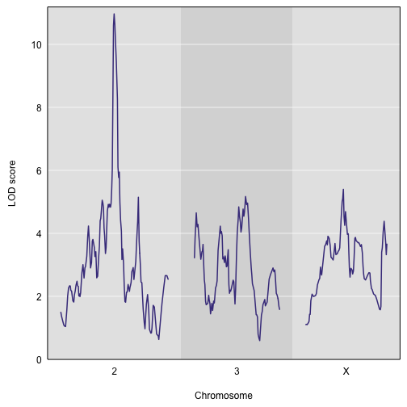
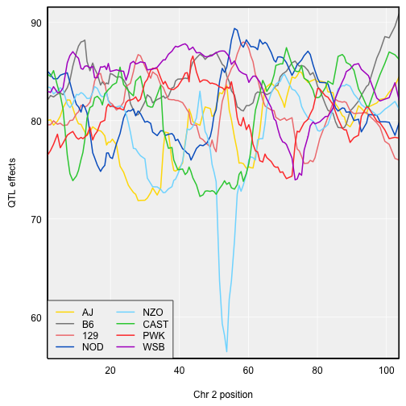
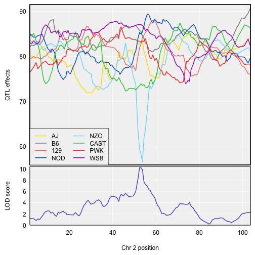

For multi-parent crosses, it can be useful to collapse the genotype or allele probabilities according to the founder genotypes of the various
SNPs in the region of a QTL.

### QTL analysis in Diversity Outbred mice

To illustrate this sort of SNP association analysis, we'll consider some Diversity Outbred mouse data. The Diversity Outcross (DO) mice are an advanced intercross population derived from the same eight founder strains as the Collaborative Cross (CC). See
[Svenson et al. (2012)](https://www.ncbi.nlm.nih.gov/pubmed/22345611)
and [Gatti et al. (2014)](https://www.ncbi.nlm.nih.gov/pubmed/25237114).

We'll consider a subset of the data from
[Recla et al. (2014)](https://www.ncbi.nlm.nih.gov/pubmed/24700285), available as part of the
[qtl2data github repository](https://github.com/rqtl/qtl2data). (The
full data are in
[`DO_Recla`](https://github.com/rqtl/qtl2data/tree/master/DO_Recla); the directory
[`DOex`](https://github.com/rqtl/qtl2data/tree/master/DOex) contains a reduced set, with just three chromosomes, one phenotype (`OF_immobile_pct`, percent immobile in the open field test), and a
reduced set of markers.

You can download the data from a single zip file, as follows:

~~~
DOex <- read_cross2(file = "https://raw.githubusercontent.com/rqtl/qtl2data/master/DOex/DOex.zip")
~~~
{: .r}

Let's quickly whip through a basic analysis.

We first calculate genotype probabilities and convert them to allele probabilities. We'll just use marker locations and not insert any pseudomarkers.

~~~
pr <- calc_genoprob(DOex, error_prob=0.002)
apr <- genoprob_to_alleleprob(pr)
~~~
{: .r}

We calculate kinship matrices (using the "LOCO" method, though with the caveat that here we are only considering genotypes on three chromosomes).

~~~
k <- calc_kinship(apr, "loco")
~~~
{: .r}

We create a numeric covariate for sex; be sure to include the individual IDs as names.

~~~
sex <- (DOex$covar$Sex == "male")*1
names(sex) <- rownames(DOex$covar)
~~~
{: .r}

Note that you can create the vector and assign the names in one step using the basic R function setNames().

~~~
sex <- setNames( (DOex$covar$Sex == "male")*1, rownames(DOex$covar) )
~~~
{: .r}

We perform a genome scan with a linear mixed model (adjusting for a residual polygenic effect), with sex as an additive covariate.

~~~
out <- scan1(apr, DOex$pheno, k, sex)
~~~
{: .r}

Here's a plot of the results.

~~~
par(mar=c(4.1, 4.1, 0.6, 0.6))
plot(out, DOex$gmap)
~~~
{: .r}

There's a strong peak on chromosome 2. Let's look at the QTL effects. We estimate them with `scan1coef()`. We need to subset the allele probabilities and the list of kinship matrices.

~~~
coef_c2 <- scan1coef(apr[,"2"], DOex$pheno, k[["2"]], sex)
~~~
{: .r}

For the DO, with 8 QTL alleles, we can use the function `plot_coefCC` in the [R/qtl2plot](https://github.com/rqtl/qtl2plot) package, which plots the 8 allele effects in the "official" Collaborative Cross (CC)
colors. (Well, actually _slightly_ modified colors, because I think the official colors are kind of ugly.) The strong locus seems to be mostly
due to the NZO allele. Note that `CCcolors` is a vector of colors included in the qtl2plot package; there's also a `CCorigcolors` object
with the _official_ colors.

~~~
par(mar=c(4.1, 4.1, 0.6, 0.6))
plot_coefCC(coef_c2, DOex$gmap["2"], bgcolor="gray95", legend="bottomleft")
~~~
{: .r}

If you provide `plot_coefCC()` with the genome scan output, it will display the LOD curve below the coefficient estimates.

~~~
par(mar=c(4.1, 4.1, 0.6, 0.6))
plot_coefCC(coef_c2, DOex$gmap["2"], scan1_output=out, bgcolor="gray95", legend="bottomleft")
~~~
{: .r}

### Connecting to SNP and gene databases
To perform SNP association analysis in the region of a QTL, we’ll need to grab data on all of the SNPs in the region, including their genotypes in the eight founder strains for the CC and DO populations. As a related task, we’ll also want to identify the genes in the region.

We want R/qtl2 to permit different ways of storing this information. For the CC and DO populations, we’ve prepared SQLite database files for the variants in the CC founders and for the MGI mouse gene annotations. But others might wish to use a different kind of database, or may wish to query an online database.

We provide a template for how to use R/qtl2 to connect to SNP and gene databases, with the functions `create_variant_query_func()` and `create_gene_query_func()`. Each returns a function for querying variant and gene databases, respectively. The query functions that are returned take just three arguments (chr, start, end end), and themselves return a data frame of variants on the one hand and genes on the other.

During [setup](https://smcclatchy.github.io/mapping/setup/) you would have downloaded the SQLite databases from Figshare and placed these in your `data` directory:

- [cc_variants.sqlite doi:10.6084/m9.figshare.5280229.v2](https://figshare.com/articles/SQLite_database_of_variants_in_Collaborative_Cross_founder_mouse_strains/5280229/2), variants in the Collaborative Cross founders (3 GB)
- [mouse_genes.sqlite doi:10.6084/m9.figshare.5280238.v4](https://figshare.com/articles/SQLite_database_with_mouse_gene_annotations_from_Mouse_Genome_Informatics_MGI_at_The_Jackson_Laboratory/5280238/4) full set of mouse gene annotations (677 MB)
- [mouse_genes_mgi.sqlite doi:10.6084/m9.figshare.5286019.v5](https://figshare.com/articles/SQLite_database_with_MGI_mouse_gene_annotations_from_Mouse_Genome_Informatics_MGI_at_The_Jackson_Laboratory/5286019/5) just the MGI mouse gene annotations (11 MB)

To create a function for querying the CC variants, call `create_variant_query_func()` with the path to the `cc_variants.sqlite` file:

~~~
query_variants <- create_variant_query_func("../data/cc_variants.sqlite")
~~~
{: .r}

To grab the variants in the interval 97-98 Mbp on chromosome 2, you’d then do the following:

~~~
variants_2_97.5 <- query_variants(2, 97, 98)
~~~
{: .r}

~~~
Error in query_variants(2, 97, 98): File ../data/cc_variants.sqlite doesn't exist
~~~
{: .error}

Similarly, to create a function for querying the MGI mouse gene annotations, you call `create_gene_query_func()` with the path to the `mouse_genes_mgi.sqlite` file:

~~~
query_genes <- create_gene_query_func("../data/mouse_genes_mgi.sqlite")
~~~
{: .r}

To grab the genes overlapping the interval 97-98 Mbp on chromosome 2, you’d then do the following:

~~~
genes_2_97.5 <- query_genes(2, 97, 98)
~~~
{: .r}

~~~
Error in query_genes(2, 97, 98): File ../data/mouse_genes_mgi.sqlite doesn't exist
~~~
{: .error}

The way we’ve set this up is a bit complicated, but it allows greatest flexibility on the part of the user. And for our own work, we like to have a local SQLite database, for rapid queries of SNPs and genes.

### SNP associations

Okay, now finally we get to the SNP associations. We have a large peak on chromosome 2, and we want to look at individual SNPs in the region of the locus.

Well, actually, we first need to find the location of the inferred QTL.  The peak LOD score on chromosome 2 occurs at 52.4 cM. But to find nearby SNPs, we really want to know the Mbp position. The calculations were only performed at the marker positions, and so we can use `max()`, giving both the `scan1()` output and the physical map, and then pull out the position from the results.

~~~
peak_Mbp <- max(out, DOex$pmap)$pos
~~~
{: .r}

The marker is at 97.5 Mbp. We’ll focus on a 2 Mbp interval centered at 97.5 Mbp.

We can pull out the variants in the 2 Mbp interval centered at 97.5 on chr 2 using the query function we defined above:

~~~
variants <- query_variants(2, peak_Mbp - 1, peak_Mbp + 1)
~~~
{: .r}

~~~
Error in query_variants(2, peak_Mbp - 1, peak_Mbp + 1): File ../data/cc_variants.sqlite doesn't exist
~~~
{: .error}

There are 27737 variants in the interval, including 27492 SNPs, 101 indels, and 144 structural variants. We’re treating all of them as biallelic markers (all but the major allele in the eight founder strains binned into a single allele). In the following, we’re going to just say “SNP” rather than “variant”, even though the variants include indels and structural variants.

After identifying the variants in the interval of interest, we use our genotype probabilities and the founder SNP genotypes to infer the SNP genotypes for the DO mice. That is, at each SNP, we want to collapse the eight founder allele probabilities to two SNP allele probabilities, using the SNP genotypes of the founders.

We do this assuming that the genotype probabilities were calculated sufficiently densely that they can be assumed to be constant in intervals. With this assumption, we then:

- Find the interval for each SNP.
- Reduce the SNPs to a “distinct” set: if two SNPs have the same strain distribution pattern (SDP; the pattern of alleles in the eight founders) and are in the same interval, by our assumption their allele probabilities will be the same.
- Take the average of the allele probabilities at the two endpoints of each interval.
- Collapse the 8 allele probabilities to two according to each observed SDP in the interval.
- We further create a look-up table relating the full set of SNPs to the reduced set (one of each observed SDP in each interval).

All of these steps are combined into a single function `scan1snps()`, which takes the genotype probabilities, a physical map of those locations, the phenotype, the kinship matrix, covariates, the query function for grabbing the SNPs in a given interval, and the chromosome, start, and end positions for the interval. (If `insert_pseudomarkers()` was used to insert pseudomarkers, you will need to use `interp_map()` to get interpolated Mbp positions for the pseudomarkers.)

~~~
out_snps <- scan1snps(pr, DOex$pmap, DOex$pheno, k[["2"]], sex, query_func=query_variants,
                      chr=2, start=peak_Mbp-1, end=peak_Mbp+1, keep_all_snps=TRUE)
~~~
{: .r}

~~~
Error in query_func(chr, start, end): File ../data/cc_variants.sqlite doesn't exist
~~~
{: .error}

The output is a list with two components: `lod` is a matrix of LOD scores (with a single column, since we’re using just one phenotype), and `snpinfo` is a data frame with SNP information. With the argument `keep_all_snps=TRUE`, the `snpinfo` data frame contains information about all of the variants in the region with an index column indicating the equivalence classes.

The function `plot_snpasso()` can be used to plot the results, with points at each of the SNPs. The default is to plot *all* SNPs. In this case, there are 27737 variants in the region, but only 150 distinct ones.

~~~
par(mar=c(4.1, 4.1, 0.6, 0.6))
plot_snpasso(out_snps$lod, out_snps$snpinfo)
~~~
{: .r}

~~~
Error in plot_snpasso(out_snps$lod, out_snps$snpinfo): object 'out_snps' not found
~~~
{: .error}

We can actually just type plot() rather than plot_snpasso(), because with the snpinfo table in place of a genetic map, plot() detects that a SNP association plot should be created.

~~~
par(mar=c(4.1, 4.1, 0.6, 0.6))
plot(out_snps$lod, out_snps$snpinfo)
~~~
{: .r}

~~~
Error in plot(out_snps$lod, out_snps$snpinfo): object 'out_snps' not found
~~~
{: .error}

We can use our `query_genes()` function to identify the genes in the region, and `plot_genes()` to plot their locations. But also `plot_snpasso()` can take the gene locations with the argument genes and then display them below the SNP association results. Here, we are also highlighting the top SNPs in the SNP association plot using the `drop_hilit` argument. SNPs with LOD score within `drop_hilit` of the maximum are shown in pink.

~~~
genes <- query_genes(2, peak_Mbp - 1, peak_Mbp + 1)
~~~
{: .r}

~~~
Error in query_genes(2, peak_Mbp - 1, peak_Mbp + 1): File ../data/mouse_genes_mgi.sqlite doesn't exist
~~~
{: .error}

~~~
par(mar=c(4.1, 4.1, 0.6, 0.6))
plot(out_snps$lod, out_snps$snpinfo, drop_hilit=1.5, genes=genes)
~~~
{: .r}

~~~
Error in plot(out_snps$lod, out_snps$snpinfo, drop_hilit = 1.5, genes = genes): object 'out_snps' not found
~~~
{: .error}

To get a table of the SNPs with the largest LOD scores, use the function `top_snps()`. This will show all SNPs with LOD score within some amount (the default is 1.5) of the maximum SNP LOD score. We’re going to display just a subset of the columns.

~~~
top <- top_snps(out_snps$lod, out_snps$snpinfo)
~~~
{: .r}

~~~
Error in top_snps(out_snps$lod, out_snps$snpinfo): object 'out_snps' not found
~~~
{: .error}

~~~
print(top[,c(1, 8:15, 20)], row.names=FALSE)
~~~
{: .r}

~~~
Error in print(top[, c(1, 8:15, 20)], row.names = FALSE): object 'top' not found
~~~
{: .error}

The top SNPs all have NZO and CAST with a common allele, different from the other 6 founders. The next-best SNPs have NZO, CAST, and 129 with a common allele, and then there’s a group of SNPs where NZO has a unique allele.

The `scan1snps()` function can also be used to perform a genome-wide SNP association scan, by providing a variant query function but leaving chr, start, and end unspecified. In this case it’s maybe best to use keep_all_snps=FALSE (the default) and only save the index SNPs.

~~~
out_gwas <- scan1snps(pr, DOex$pmap, DOex$pheno, k, sex, query_func=query_variants, cores=0)
~~~
{: .r}

~~~
Warning in parallel::mclapply(..., mc.cores = cores): all scheduled cores
encountered errors in user code
~~~
{: .error}

~~~
Error: $ operator is invalid for atomic vectors
~~~
{: .error}

We can make a Manhattan plot of the results as follows. We use `altcol` to define a color for alternate chromosomes and `gap=0` to have no gap between chromosomes.

~~~
par(mar=c(4.1, 4.1, 0.6, 0.6))
plot(out_gwas$lod, out_gwas$snpinfo, altcol="green4", gap=0)
~~~
{: .r}

~~~
Error in plot(out_gwas$lod, out_gwas$snpinfo, altcol = "green4", gap = 0): object 'out_gwas' not found
~~~
{: .error}

Note that while there are LOD scores on the X chromosome that are as large as those on chromosome 2, we’re allowing a genotype × sex interaction on the X chromosome and so the test has 3 degrees of freedom (versus 2 degrees of freedom on the autosomes) and so the LOD scores will naturally be larger. If we’d used the allele probabilities (apr above, calculated from genoprob_to_alleleprob()) rather than the genotype probabilities, we would be performing a test with 1 degree of freedom on both the X chromosome and the autosomes.

