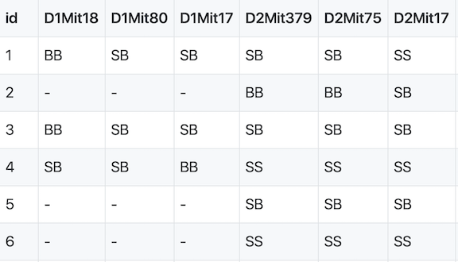

```{r, include=FALSE}
source("../bin/chunk-options.R")
knitr_fig_path("02-")
```

QTL mapping data consists of a set of tables of data: marker
genotypes, phenotypes, marker maps, etc. These different tables are in different comma-separated value (CSV) files. In each file, the first column is a set of IDs for the rows, and the first row is a set of IDs for the columns. For example, the genotype data file will have individual IDs in the first column, marker names for the rest of the column headers.



The sample genotype file above shows two alleles: S and B. These represent the founder strains for an intercross, which are C57BL/6 (BB) and SWR (SS) [(Grant et al. (2006) Hepatology 44:174-185)](https://pubmed.ncbi.nlm.nih.gov/16799992/). The B and S alleles themselves represent the haplotypes inherited from the parental strains C57BL/6 and SWR.  

In the Diversity Outbred (DO) and Collaborative Cross (CC), alleles A to H represent haplotypes of the 8 founder strains.


CC lines have very low heterozygosity throughout their genomes. For most loci, 
CC lines will be homozygous for one of the founder strains A-H above, and as
such will have one of only 8 genotypes (*e.g.* AA, BB, CC, ...). In contrast,
DO *mice* (not lines) have high heterozygosity throughout their genomes. Each
locus will have one of 36 possible genotypes (*e.g.* AA, AB, AC, ..., BB, BC, BD,...).


For the purposes of learning QTL mapping, this lesson begins with the simplest
cases: backcrosses (2 possible genotypes) and intercrosses (3 possible genotypes).
Once we have learned how to use `qtl2` for these simpler cases, we will advance
to the most complex case involving mapping in DO mice.

R/qtl2 accepts the following files:
1. genotypes
2. phenotypes
3. phenotype covariates (*i.e.* tissue type, time points)  
4. genetic map  
5. physical map (optional)  
6. control file (YAML or JSON format, not CSV)

We use both a genetic marker map and a physical map (if available). A sample from a genetic map of MIT markers is shown here.


A physical marker map provides location in bases rather than centiMorgans.


Numeric phenotypes are separate from the often non-numeric covariates.


Phenotype covariates are [metadata](https://en.wikipedia.org/wiki/Metadata) describing the phenotypes. For example, in the case of a phenotype measured over time, one column in the phenotype covariate data could be the time of measurement. For gene expression data, we would have columns representing chromosome and physical position of genes, as well as gene IDs.


In addition to the set of CSV files with the primary data, we need a separate control file with various control parameters
(or metadata), including the names of all of the other data files and the genotype codes used in the genotype data file. The control file is in a specific format using either [YAML](http://www.yaml.org) or
[JSON](http://json.org); these are human-readable text files for
representing relatively complex data.


A big advantage of this control file scheme is that it greatly
simplifies the function for reading in the data. That function,
`read_cross2()`, has a _single_ argument: the name (with path) of the control file.

For further details, see the separate [vignette on the input file format](http://kbroman.org/qtl2/assets/vignettes/input_files.html).

> ## Challenge 1
> 1. Which data files are required by `qtl2`?  
> 2. Which ones are optional?  
> 3. How should they be formatted?
>
> > ## Solution to Challenge 1
> > 1. marker genotypes, phenotypes, genetic map
> > 2. physical map
> > 1. csv; JSON or YAML for control file
> {: .solution}
{: .challenge}

## Sample data sets

In this lesson, we'll work with data sets included in the `qtl2` package. You can find out more about the [sample data files](http://kbroman.org/qtl2/pages/sampledata.html) from the R/qtl2 web site. Zipped versions of these datasets are included with the [qtl2geno](https://github.com/rqtl/qtl2geno) package and can be loaded into R using the `read_cross2()` function.
Additional sample data sets, including data on Diversity Outbred (DO) mice, are available at <https://github.com/rqtl/qtl2data>.

> ## Challenge 2
> Go to <https://github.com/rqtl/qtl2data> to view additional sample data.  
> 1). Find the Recla data and locate the phenotype data file. Open the file by clicking on the file name. What is in the first column? the first row?  
> 2). Locate the genotype data file, click on the file name, and view the raw data. What is in the first column? the first row?  
> 3). Locate the covariates file and open it by clicking on the file name. What kind of information does this file contain?  
> 4). Locate the control file (YAML or JSON format) and open it. What kind of information does this file contain?  
>
> > ## Solution to Challenge 2
> >
> > 1). What is in the first column of the phenotype file? Animal ID. The first row? Phenotype variable names - OF_distance_first4, OF_distance, OF_corner_pct, OF_periphery_pct, ...  
> > 2). What is in the first column of the genotype file? marker ID. the first row? Animal ID - 1,4,5,6,7,8,9,10, ...  
> 3). Locate the covariates file and open it. What kind of information does this file contain? Animal ID, sex, cohort, group, subgroup, ngen, and coat color.  
> 4). Locate the control file (YAML or JSON format) and open it. What kind of information does this file contain? Names of primary data files, genotype and allele codes, cross type, description, and other metadata.
> {: .solution}
{: .challenge}


## Preparing your Diversity Outbred (DO) data for qtl2

Karl Broman provides detailed instructions for [preparing DO mouse data for R/qtl2](https://kbroman.org/qtl2/pages/prep_do_data.html).


