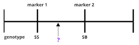

```{r, include=FALSE}
source("../bin/chunk-options.R")
knitr_fig_path("03-")
```

The first task in QTL analysis is to calculate conditional genotype probabilities, given the observed marker data, at each putative QTL position. For example, the first step would be to determine the probabilities for genotypes AA and AB at the locus indicated below.



The `calc_genoprob()` function calculates QTL genotype probabilities, conditional on the available marker data. These are needed for most of the QTL mapping functions. The result is returned as a list of three-dimensional arrays (one per chromosome). Each 3d array of probabilities is arranged as individuals &times; genotypes &times; positions.


[See this page for a graphical review of data structures in R](http://venus.ifca.unican.es/Rintro/_images/dataStructuresNew.png).  

To find QTL at positions between markers (so called "pseudomarkers"), first  insert pseudomarkers into the genetic map with the function `insert_pseudomarkers()`.

We'll use the
[iron dataset](https://github.com/kbroman/qtl2/tree/gh-pages/assets/sampledata/iron)
from [Grant et al. (2006) Hepatology 44:174-185](https://www.ncbi.nlm.nih.gov/pubmed/16799992)
(an intercross) as an example. In this study spleen and liver iron levels were measured in an F2 cross between mouse strains C57BL/6J and SWR. C57BL/6J mice exhibit low levels of non-heme iron, while SWR mice exhibit high levels. Iron levels between spleen and liver in the F2s were poorly correlated, indicating tissue-specific regulation. Significant QTL were found on chromosomes 2 and 16 for liver, and on chromosomes 8 and 9 in spleen. Candidate genes included transferrin near the chromosome 9 peak, and <i>&beta;</i>2-microglobulin near the chromosome 2 peak.

We first load the data using the function `system.file`, which finds files located in packages. The iron data are built into the qtl2 package, so we can use the `system.file()` function to load them directly from the package.

```{r load_data}
library(qtl2)
iron <- read_cross2(file = system.file("extdata", "iron.zip", package="qtl2") )
```

To load your own data from your machine, you would use the file path to your data files. For example, if the file path to your data files is `/Users/myUserName/qtlProject/data`, the command to load your data would look like this:

```{r load_my_data, eval=FALSE, error=FALSE}
myQTLdata <- read_cross2(file = "/Users/myUserName/qtlProject/data/myqtldata.yaml" )
```

The YAML file contains all control information for your data, including names of data files, cross type, column specifications for sex and cross information, and more. This can also be in JSON format. Alternatively, all data files can be zipped together for loading.

```{r load_my_zipdata, eval=FALSE, error=FALSE}
myQTLdata <- read_cross2(file = "/Users/myUserName/qtlProject/data/myqtldata.zip" )
```

Back to the iron data. Now look at a summary of the cross data and the names of each variable within the data.

```{r summary_data}
summary(iron)
names(iron)
```

Have a look at the markers listed in the genetic map, `gmap`. Markers are listed by chromosome and described by cM position. View only the markers on the first several chromosomes.

```{r map_data}
head(iron$gmap)
```

We then use `insert_pseudomarkers()` to insert pseudomarkers into the
genetic map, which we grab from the `iron` object as `iron$gmap`:

```{r insert_pseudomarkers}
map <- insert_pseudomarkers(map=iron$gmap, step=1)
```

Pseudomarkers are inserted at regular intervals, and genotype probabilities will be calculated at each of these intervals. Now have a look at the new object called `map`. View only the first two chromosomes.

```{r view_map}
head(map, n=2)
```

Notice that pseudomarkers are now spaced at 1 cM intervals from genotyped markers. The argument `step=1` generated pseudomarkers at these intervals. 

Next we use `calc_genoprob()` to calculate the QTL genotype probabilities.

```{r calc_genoprob}
pr <- calc_genoprob(cross=iron, map=map, error_prob=0.002)
```

The argument `error_prob` supplies an assumed genotyping error probability of 0.002. If a value for `error_prob` is not supplied, the default probability is 0.0001. 

Recall that the result of `calc_genoprob`, `pr`, is a list of three-dimensional arrays (one per chromosome). 

```{r list_chrs}
names(pr)
```

Each 3d array of probabilities is arranged as individuals &times; genotypes &times; positions. Have a look at the names of each of the three dimensions for chromosome 19.

```{r view_array}
dimnames(pr$`19`)
```

View the first three rows of genotype probabilities for the first genotyped marker on chromosome 19, and the two adjacent pseudomarkers located at 1 cM intervals away. Compare the probabilities for each pseudomarker genotype with those of the genotyped marker.

```{r view_genoprob}
(pr$`19`)[1:3,,"D19Mit68"] # genotyped marker
(pr$`19`)[1:3,,"c19.loc4"] # pseudomarker 1 cM away
(pr$`19`)[1:3,,"c19.loc5"] # the next pseudomarker
```

> ## Challenge 1
> Find a partner and explain why calculating genotype probabilities is the first step in QTL analysis. Why do you need to insert pseudomarkers first? Listen to your partner's explanation, then write your responses in the collaborative document.
>
> > ## Solution to Challenge 1
> >
> {: .solution}
{: .challenge}


> ## Challenge 2
> Calculate genotype probabilities for a different data set built into the qtl2 package, this one from a study of root gravitropism in *Arabidopsis*.   
> 1). Load the grav2.zip file from the rqtl2 package into an object called `grav`.  
> 2). View a summary of the `grav` data. How many individuals? phenotypes? chromosomes? markers? 
> 3). View the genetic map for the `grav` data.  
> 4). Insert pseudomarkers at 2 cM intervals. Assign the results to an object called `gravmap`.  
> 5). Calculate genotype probabilities assuming a genotyping error probability of 0.001. Assign the results to an object called `gravpr`.  
> 6). View the first several rows of genotype probabilities for 
> any marker on chromosome 5.  
>
> > ## Solution to Challenge 2
> >
> > 1). `grav <- read_cross2(file = system.file("extdata", "grav2.zip", package="qtl2"))`  
> > 2). `summary(grav)` shows 162 individuals, 241 phenotypes, 5 chromosomes, 234 markers.
> > 3). `grav$gmap`  
> > 4). `gravmap <- insert_pseudomarkers(map=grav$gmap, step=2)`  
> > 5). `gravpr <- calc_genoprob(cross=grav, map=gravmap, error_prob=0.001)`  
> > 6). `head((gravpr$`5`)[,,"c5.loc4"])` for an example pseudomarker, or `head((gravpr$`5`)[,,"GB.102L-Col/105C"])` for an example of a genotyped marker
> {: .solution}
{: .challenge}

**Parallel calculations (optional)** To speed up the calculations with large datasets on a multi-core machine, you can use the argument `cores`. With `cores=0`, the number of available cores will be detected via `parallel::detectCores()`. Otherwise, specify the number of cores as a positive integer.

```{r calc_genoprob_multicore, eval=FALSE}
pr <- calc_genoprob(cross=iron, map=map, error_prob=0.002, cores=4)
```

**Allele probabilities (optional)** The genome scan functions use genotype probabilities as well as a matrix of phenotypes. If you wished to perform a genome scan via an additive allele model, you would first convert the genotype probabilities to allele probabilities, using the function `genoprob_to_alleleprob()`.

```{r allele_probs}
apr <- genoprob_to_alleleprob(probs=pr)
```

The figure below shows genotype and allele probabilities for 3 samples. In the Diversity Outbred, 
there are 36 possible genotype states 
(AA, AB, AC, ..., BB, BC, BD, ..., CC, CD, CE, ..., DD, DE, DF, ..., EE,...) or 8 + 7 + 6 + 5 + 4 + 3 + 2 + 1.
The first SNP below has genotype BB. In the table describing alleles (8 state founder probabilities), the 
probability that this SNP has a B allele is 1. The 2nd SNP has genotype BH, so the allele table shows a 
probability of 0.5 for B and 0.5 for H. The third SNP is either BG or BH, and has a probability of 0.5
for each of these genotypes. The allele table shows a probability of 0.5 for allele B, and 0.25 for both
G and H.


