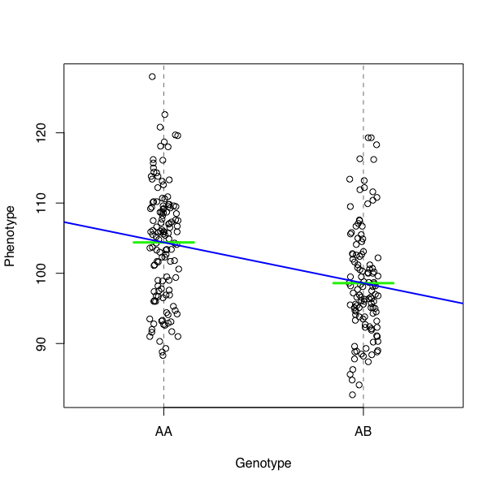

```{r, include=FALSE}
source("../bin/chunk-options.R")
knitr_fig_path("06-")
```

A regression line drawn between phenotype means for two genotype groups AA and AB will have a slope of zero if there is no difference between the group means. A slope not equal to zero indicates a difference in group means and the presence of a QTL near the markers. Marker regression can identify the existence and effect of a QTL by comparing means between groups, however, it requires known marker genotypes and can't identify QTL in between typed markers.



In Haley-Knott regression, we can regress the phenotypes on the conditional genotype probabilities (conditional on known marker genotypes). After calculating genotype probabilities between typed markers, phenotype values can be plotted and a regression line drawn through the phenotype mean for the untyped individuals.


To perform a genome scan by Haley-Knott regression
([Haley and Knott 1992](https://www.ncbi.nlm.nih.gov/pubmed/16718932)),
use the function `scan1()` in
[qtl2scan](https://github.com/rqtl/qtl2scan). (The previous functions 
were all from [qtl2geno](https://github.com/rqtl/qtl2geno); from here
forward, the functions are all from
[qtl2scan](https://github.com/rqtl/qtl2scan).)

`scan1()` takes as input the genotype probabilities, a matrix of phenotypes, and then optional additive and interactive covariates, and the special X chromosome covariates. Another option is to provide a
vector of weights.

```{r scan1, eval=FALSE, include=FALSE}
library(qtl2scan)
out <- scan1(pr, iron$pheno, Xcovar=Xcovar)
```

On a multi-core machine, you can get some speed-up via the `cores` argument, as with `calc_genoprob()` and `calc_kinship()`.

```{r scan1_multicore, eval=FALSE}
out <- scan1(pr, iron$pheno, Xcovar=Xcovar, cores=4)
```

The output of `scan1()` is a matrix of LOD scores, positions &times; phenotypes. (Well, actually, the output is a list including `"lod"` which is this matrix of LOD scores, but also including the
genetic map and other details.)

The function `plot_scan1()` in the
[qtl2plot](https://github.com/rqtl/qtl2plot) package can be used to plot the LOD curves. You can just write `plot()`, as there's an S3 method `plot.scan1()` and the output of `scan1()` has class `"scan1"`.

Use the argument `lodcolumn` to indicate which column to plot. Unlike the `plot.scanone()` function in [R/qtl](http://rqtl.org), the `plot_scan1()` function will only plot one set of LOD curves at a time, and you need to provide the marker/pseudomarker map (created by `insert_pseudomarkers()`).

```{r plot_lod, eval=FALSE}
library(qtl2plot)
par(mar=c(5.1, 4.1, 1.1, 1.1))
ymx <- maxlod(out) # overall maximum LOD score
plot(out, map, lodcolumn=1, col="slateblue", ylim=c(0, ymx*1.02))
plot(out, map, lodcolumn=2, col="violetred", add=TRUE)
legend("topleft", lwd=2, col=c("slateblue", "violetred"), colnames(out), bg="gray90")
```

