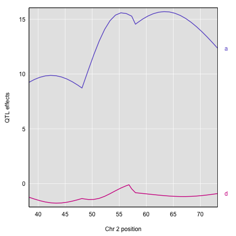
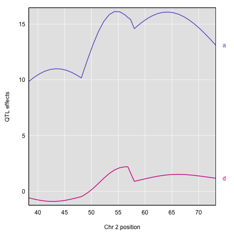
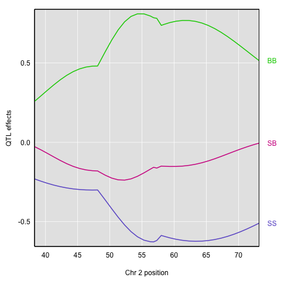

```{r, include=FALSE}
source("../bin/chunk-options.R")
knitr_fig_path("11-")
```

```{r load_dependencies, echo=FALSE}
library(qtl2)
iron <- read_cross2( system.file("extdata", "iron.zip", package="qtl2") )
map <- insert_pseudomarkers(map=iron$gmap, step=1)
pr <- calc_genoprob(cross=iron, map=map, error_prob=0.002)
kinship <- calc_kinship(pr)
kinship_loco <- calc_kinship(pr, "loco")
Xcovar <- get_x_covar(iron)
out <- scan1(genoprobs = pr, pheno = iron$pheno, Xcovar=Xcovar)
out_pg_loco <- scan1(pr, iron$pheno, kinship_loco, Xcovar=Xcovar)
bin_pheno <- apply(iron$pheno, 2, function(a) as.numeric(a > median(a)))
rownames(bin_pheno) <- rownames(iron$pheno)
c2eff <- scan1coef(pr[,"2"], iron$pheno[,"liver"])
```

Recall that to model data from a cross, we use

  
 

where <i>y<sub>j</sub></i> is the phenotype of the <i>j</i>th individual, &mu; 
is the mean phenotype value, <i>&beta;<sub>k</sub></i> is the effect of the 
<i>kth</i> genotype, <i>X<sub>jk</sub></i> is the genotype for individual j, and &epsilon;<sub>j</sub> is the error for the <i>j</i>th individual. In the figure 
below, &mu; equals `r round(c2eff["D2Mit17", 4], 1)`, and &beta; equals 
`r round(abs(c2eff["D2Mit17", 1]), 1)` for the alternative hypothesis 
(QTL exists).


This linear model is <i>y</i> = `r round(c2eff["D2Mit17",4], 1)` + 
`r round(abs(c2eff["D2Mit17",1]), 1)`X + &epsilon;. The model intersects the 
genotype groups at their group means, and is based on &mu; and 
<i>&beta;<sub>k</sub></i> for chromosome 2 marker D2Mit17 located at 56.8 cM.  

The effect of genotype `r dimnames(c2eff)[[2]][[3]]` (the &beta; for the 
`r dimnames(c2eff)[[2]][[3]]` genotype) at marker D2Mit17 is 
`r round(c2eff["D2Mit17", 3], 1)`, while the effect of the 
`r dimnames(c2eff)[[2]][[1]]` genotype is `r round(c2eff["D2Mit17", 1], 1)` on 
the liver phenotype. The effect of the `r dimnames(c2eff)[[2]][[2]]` genotype is 
`r round(c2eff["D2Mit17",2], 1)` relative to &mu; equals 
`r round(c2eff["D2Mit17",4], 1)`.

The `scan1()` function returns only LOD scores. To obtain estimated QTL effects,
use the function `scan1coef()`. This function takes a single phenotype and the 
genotype probabilities for a single chromosome and returns a matrix with the 
estimated coefficients at each putative QTL location along the chromosome.

For example, to get the estimated QTL effects on chromosome 2 for the liver 
phenotype, we would provide the chromosome 2 genotype probabilities and the 
liver phenotype to the function `scan1coef()` as follows:

```{r est_effects_liver_c2}
c2eff <- scan1coef(pr[,"2"], iron$pheno[,"liver"])
```

The result is a matrix of `r nrow(c2eff)` positions &times; `r ncol(c2eff)-1` 
genotypes. An additional column contains the intercept values (&mu;).

```{r effects_matrix_dim}
dim(c2eff)
head(c2eff)
```

To plot the QTL effects, use the function `plot_coef()`.

```{r plot_effects_liver_simple}
plot_coef(c2eff, map, legend = "topright")
```

The plot shows effect values on the y-axis and cM values on the x-axis. The
value of the intercept (&mu;) appears at the top. The effect of the `r dimnames(c2eff)[[2]][[2]]` genotype is centered around zero, with the effects
of the other two genotypes above and below.  

To plot only the effects, use the argument `columns` to indicate which 
coefficients to plot. Add `scan1_output` to include a LOD plot at the bottom.

```{r plot_effects_liver_c2}
plot_coef(c2eff, map, columns = 1:3, scan1_output = out, 
          main = "Chromosome 2 QTL effects and LOD scores",
          legend = "topright")
```

If instead you want additive and dominance effects, you can provide a square matrix of _contrasts_, as follows:

```{r est_effects_liver_c2_contr}
c2effB <- scan1coef(pr[,"2"], iron$pheno[,"liver"],
                    contrasts=cbind(mu=c(1,1,1), a=c(-1, 0, 1), d=c(-0.5, 1, -0.5)))

```

The result will then contain the estimates of `mu`, `a` (the additive effect), and `d` (the dominance effect). 

```{r add_dom_matrix_dim}
dim(c2effB)
head(c2effB)
```
For marker D2Mit17, `mu`, `a`, and `d` are `r (c2effB)[which(rownames(c2effB)=="D2Mit17"),]`.

Here's a plot of the chromosome 2 additive and dominance effects, which are in the second and third columns.

```{r add_dom_contrasts, eval=FALSE}
plot_coef(c2effB, map["2"], columns=2:3, col=col)
```



If you provide a kinship matrix to `scan1coef()`, it fits a linear mixed model (LMM) to account for a residual polygenic effect. Here let's use the kinship matrix from the LOCO method.

```{r est_effects_pg_liver_c2}
c2eff_pg <- scan1coef(pr[,"2"], iron$pheno[,"liver"], kinship_loco[["2"]])
dim(c2eff_pg)
head(c2eff_pg)
```

Here's a plot of the estimates.

```{r plot_effects_pg_liver_c2}
plot_coef(c2eff_pg, map, columns = 1:3, scan1_output = out_pg_loco, main = "Chromosome 2 QTL effects and LOD scores", legend = "topright")
```

You can also get estimated additive and dominance effects, using a matrix of contrasts.

```{r est_effects_pg_liver_c2_contr}
c2effB_pg <- scan1coef(pr[,"2"], iron$pheno[,"liver"], kinship_loco[["2"]],
                       contrasts=cbind(mu=c(1,1,1), a=c(-1, 0, 1), d=c(-0.5, 1, -0.5)))
```

Here's a plot of the results.

```{r add_dom_contrasts_loco, eval=FALSE}
plot(c2effB_pg, map["2"], columns=2:3, col=col)
```



Another option for estimating the QTL effects is to treat them as [random effects](https://stats.stackexchange.com/questions/4700/what-is-the-difference-between-fixed-effect-random-effect-and-mixed-effect-mode#151800) and calculate [Best Linear Unbiased Predictors](https://en.wikipedia.org/wiki/Best_linear_unbiased_prediction) (BLUPs). This is particularly valuable for multi-parent populations such as the Collaborative Cross and Diversity Outbred mice, where the large number of possible genotypes at a QTL leads to considerable variability in the effect estimates. To calculate BLUPs, use `scan1blup()`; it takes the same arguments as `scan1coef()`, including
the option of a kinship matrix to account for a residual polygenic effect.

```{r scan1blup}
c2blup <- scan1blup(pr[,"2"], iron$pheno[,"liver"], kinship_loco[["2"]])
```

Here is a plot of the BLUPs (as dashed curves) alongside the standard estimates.

```{r plotblup}
plot_coef(c2eff, map["2"], columns=1:3)
plot(c2blup, map["2"], columns=1:3, add=TRUE, lty=2, legend = "topright")
```

The `scan1coef` function can also provide estimated QTL effects for binary traits, with `model="binary"`. (However, `scan1blup` has not yet been implemented for binary traits.)

```{r scan1coef_binary}
c2eff_bin <- scan1coef(pr[,"2"], bin_pheno[,"liver"], model="binary")
```

Here's a plot of the effects. They're a bit tricky to interpret, as they are basically log odds ratios.



Finally, to plot the raw phenotypes against the genotypes at a single putative QTL position, you can use the function `plot_pxg()`. This takes a vector of genotypes as produced by the `maxmarg()` function, which picks the most likely genotype from a set of genotype probabilities, provided it is greater than some specified value (the argument `minprob`). Note that the “marg” in “maxmarg” stands for “marginal”, as this function is selecting the genotype at each position that has maximum marginal probability.

For example, we could get inferred genotypes at the chr 2 QTL for the liver phenotype (at 28.6 cM) as follows:

```{r get_inferred_genotypes}
g <- maxmarg(pr, map, chr=2, pos=28.6, return_char=TRUE)
```

We use `return_char=TRUE` to have `maxmarg()` return a vector of character strings with the genotype labels.

We then plot the liver phenotype against these genotypes as follows:

```{r plot_pheno_geno}
par(mar=c(4.1, 4.1, 0.6, 0.6))
plot_pxg(g, iron$pheno[,"liver"], ylab="Liver phenotype")
```

```{r plot_pheno_geno_se}
par(mar=c(4.1, 4.1, 0.6, 0.6))
plot_pxg(g, iron$pheno[,"liver"], SEmult=2, swap_axes=TRUE, xlab="Liver phenotype")
```


> ## Challenge 1
> Find the QTL effects for chromosome 16 for the liver phenotype.  
> 1) Create an object `c16eff` to contain the effects.  
> 2) Plot the chromosome 16 coefficients and add the LOD plot at bottom.
>
> >
> > ## Solution to Challenge 1
> > 1) `c16eff <- scan1coef(pr[,"16"], iron$pheno[,"liver"])`  
> > 2) `plot_coef(c16eff, map, legend = "topright", scan1_output = out)`
> {: .solution}
{: .challenge}

> ## Challenge 2
> In the code block above, we use `swap_axes=TRUE` to place the phenotype
> on the x-axis. 
> We can use `SEmult=2` to include the mean ± 2 SE intervals.  
> 1) How would you decide which chromosome to plot? Discuss this with 
> your neighbor, then write your responses in the collaborative document.  
> 2) Calculate and plot the best linear unbiased predictors (blups) for
> spleen on the chromosome of your choice.
>
> >
> > ## Solution to Challenge 2
> >
> >
> {: .solution}
{: .challenge}
