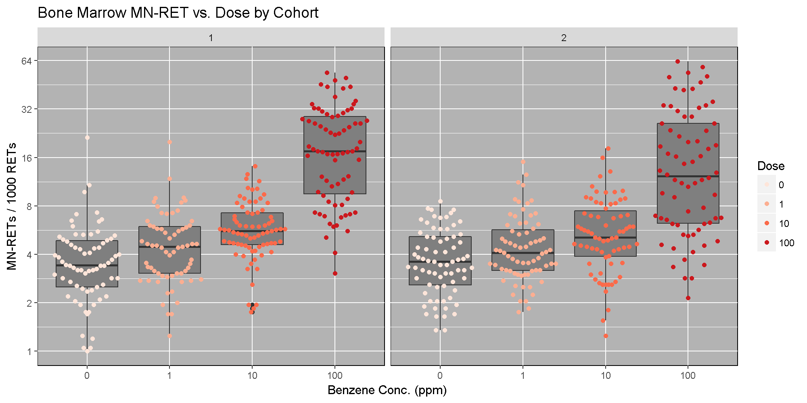
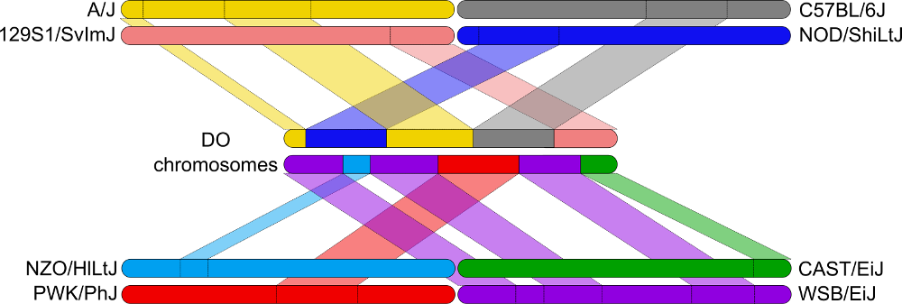
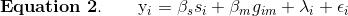
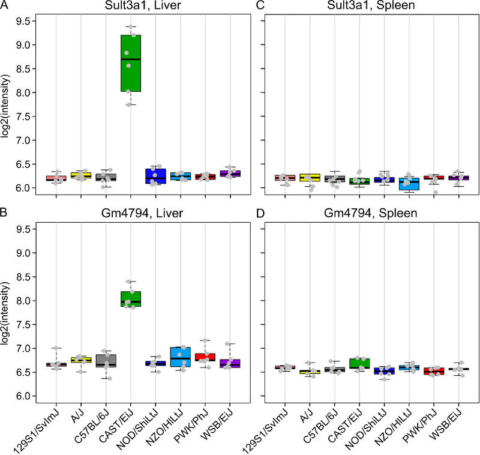
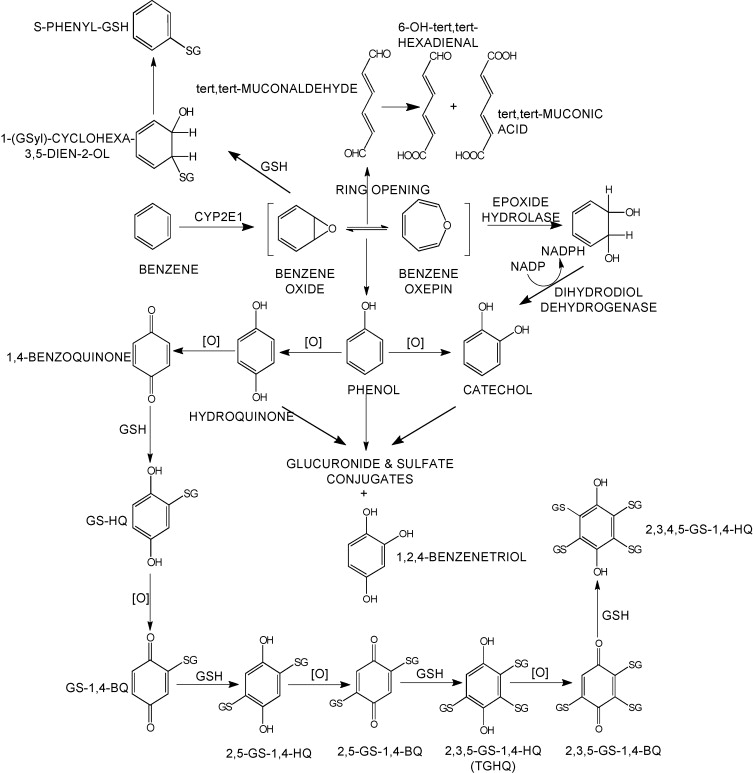

```{r, include=FALSE}
source("../bin/chunk-options.R")
knitr_fig_path("13-")
```

```{r message=FALSE, echo=FALSE}
library(qtl2)
```

This tutorial will take you through the process of mapping a QTL and searching for candidate genes for DNA damage from benzene exposure. The adverse health effects of benzene, including leukemia and aplastic anemia, were first studied in occupational settings in which workers were exposed to high benzene concentrations. Environmental sources of benzene exposure typically come from the petrochemical industry, however, a person’s total exposure can be increased from cigarettes, consumer products, gas stations, and gasoline powered engines or tools stored at home. 

Exposure thresholds for toxicants are often determined using animal models that have limited genetic diversity, including standard inbred and outbred rats and mice. These animal models fail to capture the influence of genetic diversity on toxicity response, an important component of human responses to chemicals such as benzene. The Diversity Outbred (DO) mice reflect a level of genetic diversity similar to that of humans.

The data comes from a toxicology study in which Diversity Outbred (DO) mice were exposed to benzene via inhalation for 6 hours a day, 5 days a week for 4 weeks  [(French, J. E., et al. (2015) <i>Environ Health Perspect</i> 123(3): 237-245)](http://ehp.niehs.nih.gov/1408202/). The study was conducted in two equally sized cohort of 300 male mice each, for a total of 600 mice. They were then sacrificed and reticulocytes (red blood cell precursors) were isolated from bone marrow. The number of micro-nucleated reticulocytes, a measure of DNA damage, was then measured in each mouse. The goal is to map gene(s) that influence the level of DNA damage in the bone marrow. 


### Load and explore the data

Make sure that you are in your scripts directory. If you're not sure where you are working right now, you can check your working directory with `getwd()`. If you are not in your scripts directory, run `setwd("scripts")` in the Console or Session -> Set Working Directory -> Choose Directory in the RStudio menu to set your working directory to the scripts directory.

Once you are in your scripts directory, create a new R script with File -> New File -> R script, or use the +document icon at upper left.

The data for this tutorial has been saved as an R binary file that contains several data objects.  Load it in now by running the following command in your new script.

```{r load_data, message=FALSE, results='hide'}
load("../data/qtl2_demo.Rdata")
sessionInfo()
```

The call to `sessionInfo` provides information about the R version running on your machine and the R packages that are installed. This information can help you to troubleshoot. If you can't load the data, try downloading the data again by copying and pasting the following into your browser: ftp://ftp.jax.org/dgatti/qtl2_workshop/qtl2_demo.Rdata

We loaded in three data objects. Check the Environment tab to see what was loaded.  You should see a phenotypes object called `pheno` with `r dim(pheno)[1]` observations (in rows) of `r dim(pheno)[2]` variables (in columns), an object called `map` (physical map), and an object called `probs` (genotype probabilities).

#### Phenotypes  
`pheno` is a data frame containing the phenotype data. Click on the triangle to the left of `pheno` in the Environment pane to view its contents. Run `names(pheno)` to list the variables.

**NOTE:** the sample IDs must be in the rownames of `pheno`. For more information about data file format, see the [Setup](../setup.md) instructions.

`pheno` contains the sample ID, sex, the study cohort, the concentration of benzene and the proportion of bone marrow reticulocytes that were micro-nucleated `(prop.bm.MN.RET)`.  Note that the sample IDs are also stored in the rownames of `pheno`. In order to save time for this tutorial, we will only map with `r dim(pheno)[1]` samples from the 100 ppm dosing group.

> ## Challenge 1 Look at the Data
> Determine the dimensions of `pheno`.  
> 1). How many rows and columns does it have?  
> 2). What are the names of the variables it contains?  
> 3). What does the distribution of the `prop.bm.MN.RET` column look like? Is it normally distributed?  
>
> > ## Solution to Challenge 1
> > `dim(pheno)`  
> > 1). `dim(pheno)[1]` gives the number of rows and `dim(pheno)[2]` the number of columns.
You can also use the structure command `str(pheno)`, which will tell you that this is a data frame with 598 observations of 12 variables. It will also list the 12 variable names for you.  
> > 2). Use `colnames(pheno)` or `names(pheno)`, or click the triangle to the left of `pheno`
> > in the Environment tab.  
> > 3). Use `hist(pheno$prop.bm.MN.RET)` to plot the distribution of the data. The data has a long right 
> > tail and is not normally distributed.  
> {: .solution}
{: .challenge}

Many statistical models, including the QTL mapping model in qtl2, expect that the incoming data will be normally distributed. You may use transformations such as log or square root to make your data more normally distributed. We will be mapping the proportion of micronucleated reticulocytes in bone marrow (`prop.bm.MN.RET`) and, since the data does not contain zeros or negative numbers, we will log transform the data. Here is a histogram of the untransformed data.

```{r hist_untransformed}
hist(pheno$prop.bm.MN.RET, main = "Proportion of micronucleated reticulocytes")
```

Apply the `log()` function to this data.

```{r log_transform}
pheno$log.MN.RET <- log(pheno$prop.bm.MN.RET)
```

Now, let's make a histogram of the log-transformed data.

```{r hist_log_transform}
hist(pheno$log.MN.RET, main = "Proportion of micronucleated reticulocytes (log-transformed)")
```

This looks much better!

Some researchers are concerned about the reproducibility of DO studies. The argument is that each DO mouse is unique and therefore can never be reproduced. But this misses the point of using the DO. While mice are the sampling unit, in QTL mapping we are sampling the founder alleles at each locus. An average of 1/8th of the alleles should come from each founder at any given locus. Also, DO mice are a *population* of mice, not a single strain. While it is true that results in an individual DO mouse may not be reproducible, results at the population level should be reproducible. This is similar to the human population in that results from one individual may not represent all humans, but results at the population level should be reproducible.

The benzene inhalation study was conducted in two separate cohorts (termed *Study* in the `pheno` object). Below, we plot the proportion of micronucleated reticulocytes in bone marrow versus the benzene concentration for each study cohort. As you can see, while individual mice have varying micronucleated reticulocytes, there is a dose-dependent increase in micronucleated reticulocytes in both cohorts. This is an example of how results in the DO reproduce at the population level.




#### The Marker Map  

The marker map for each chromosome is stored in the `map` object. Each list element is a numeric vector with each marker position in megabases (Mb). This is used to plot the LOD scores calculated at each marker during QTL mapping.

The markers are from a genotyping array called the Mouse Universal Genotyping Array (MUGA) and contains 7,856 SNP markers. Marker locations for the MUGA and other mouse arrays are available from [The Jackson Laboratory's FTP site](ftp://ftp.jax.org/MUGA).

Look at the structure of `map` in the Environment tab by clicking the triangle to the left or by running `str(map)` in the Console. 

> ## Challenge 2 Data Dimensions II
> 1). Determine the length of `map`.  
> 2). How many markers are on chromosome 1?  
>
> > ## Solution to Challenge 2  
> > 1). `length(map)`  
> > 2). `length(map[[1]])`  
> {: .solution}
{: .challenge} 

#### Genotype (allele) probabilities  
Each element of `probs` is a 3 dimensional array containing the founder allele dosages for each sample at each marker on one chromosome. These probabilities have been pre-calculated for you, so you can skip the step for [calculating genotype probabilities](https://smcclatchy.github.io/mapping/03-calc-genoprob/) and the optional step for calculating allele probabilities.

Next, we look at the dimensions of `probs` for chromosome 1:

```{r dim_probs}
dim(probs[[1]])
```

`probs` is a three dimensional array containing the proportion of each founder haplotype at each marker for each DO sample.  The `r dim(probs[[1]])[1]` samples are in the first dimension, the 8 founders in the second and the `r dim(probs[[1]])[3]` markers along chromosome 1 are in the third dimension.
Let's return to the `probs` object. Look at the contents for the first 500 markers of one sample.

**NOTE:** the sample IDs must be in the rownames of `probs`.

```{r geno_plot, fig.width=8, fig.height=6}
plot_genoprob(probs, map, ind = 1, chr = 1)
```

In the plot above, the founder contributions, which range between 0 and 1, are colored from white (= 0) to black (= 1.0). A value of ~0.5 is grey. The markers are on the X-axis and the eight founders (denoted by the letters A through H) on the Y-axis. Starting at the left, we see that this sample has genotype BB because the row for B is black, indicating values of 1.0. Moving along the genome to the right, the genotype becomes CE where rows C and E are gray, followed by CD, FH, AG, GH, etc. The values at each marker sum to 1.0.  


### [Calculating A Kinship Matrix](https://smcclatchy.github.io/mapping/04-calc-kinship/)
Next, we need to create a matrix that accounts for the kinship relationships between the mice. We do this by looking at the correlation between the founder haplotypes for each sample at each SNP. For each chromosome, we create a kinship matrix using all markers *except* the ones on the current chromosome using the loco (leave-one-chromosome-out) method. Simulations suggest that mapping using this approach increases the power to detect QTL.
           
```{r kinship, message=FALSE, results='hide'}
K <- calc_kinship(probs = probs, type = "loco")
```

Kinship values between pairs of samples range between 0 (no relationship) and 1.0 (completely identical). Let's look at the kinship matrix.

```{r kinship_probs, fig.width=8, fig.height=8}
n_samples <- 50
heatmap(K[[1]][1:n_samples, 1:n_samples])
```

The figure above shows kinship between all pairs of samples. Light yellow indicates low kinship and dark red indicates higher kinship. Orange values indicate varying levels of kinship between 0 and 1. The dark red diagonal of the matrix indicates that each sample is identical to itself. The orange blocks along the diagonal may indicate close relatives (i.e. siblings or cousins).

#### Covariates    
Next, we need to create additive covariates that will be used in the mapping model. We will use study cohort as a covariate in the mapping model. If we were mapping with *all* mice, we would also add benzene concentration to the model. This study contained only male mice, but in most cases, you would include sex as an additive covariate as well.

```{r covariates}
addcovar <- model.matrix(~Study, data = pheno)[,-1]
```         

The code above copies the `rownames(pheno)` to `rownames(addcovar)` as a side-effect.

**NOTE:** the sample IDs must be in the rownames of `pheno`, `addcovar`, `genoprobs` and `K`. `qtl2` uses the sample IDs to align the samples between objects. For more information about data file format, see [Karl Broman's vignette on input file format](http://kbroman.org/qtl2/assets/vignettes/input_files.html).

### [Performing a genome scan](https://smcclatchy.github.io/mapping/06-perform-genome-scan/)  

Before we run the mapping function, let's look at the mapping model. At each marker on the genotyping array, we will fit a model that regresses the phenotype (micronucleated reticulocytes) on covariates and the founder allele proportions.  


  where:  
  
<ul>
<li><i>y<sub>i</sub></i> is the phenotype for mouse <i>i</i>,</li>
  <li><i>&beta;<sub>s</sub></i> is the effect of study cohort,</li>
  <li><i>s<sub>i</sub></i> is the study cohort for mouse <i>i</i>,</li>
  <li><i>&beta;<sub>j</sub></i> is the effect of founder allele <i>j</i>,</li>
  <li><i>g<sub>ij</sub></i> is the probability that mouse <i>i</i> carries an allele from founder <i>j</i>,</li>
  <li><i>&lambda;<sub>i</sub></i> is an adjustment for kinship-induced correlated errors for mouse <i>i</i>,</li>
  <li><i>&epsilon;<sub>i</sub></i> is the residual error for mouse <i>i</i>.</li>
  </ul>  

Note that this model will give us an estimate of the effect of each founder allele at each marker. There are eight founder strains that contributed to the DO, so we will get eight founder allele effects.

There are almost 600 samples in this data set and it may take several minutes to map one trait. In order to save some time, we will map using only the samples in the 100 ppm concentration group.

```{r select_100ppm}
c100 <- which(pheno$Conc == 100)
```

In order to map the proportion of bone marrow reticulocytes that were micro-nucleated, you will use the [scan1](https://github.com/rqtl/qtl2/blob/master/R/plot_scan1.R) function. To see the arguments for [scan1](https://github.com/rqtl/qtl2/blob/master/R/plot_scan1.R), you can type `help(scan1)`. First, let's map the *untransformed* phenotype. (Recall that we log-transformed it above).

```{r QTL, warning=FALSE, error=FALSE}
index <- which(colnames(pheno) == "prop.bm.MN.RET")
qtl <- scan1(genoprobs = probs, pheno = pheno[c100,index, drop = FALSE], kinship = K, addcovar = addcovar)
```

Next, we plot the genome scan.

```{r qtl_plot, fig.width=8, fig.height=6, warning=FALSE}
plot_scan1(x = qtl, map = map, main = "Proportion of Micro-nucleated Bone Marrow Reticulocytes")
```

> ## Challenge 3 How does a log-tranformation change the QTL plot?
> 1). Perform a genome scan on the column called `log.MN.RET`. (Hint: set `index` to the column index in `pheno`.)  
> 2). How does the LOD score for the peak on Chr 10 change?
> > ## Solution to Challenge 3
> > 1). `index <- which(colnames(pheno) == "prop.bm.MN.RET")`  
> > `qtl <- scan1(genoprobs = probs, pheno = pheno[c100,index, drop = FALSE], kinship = K, addcovar = addcovar)`  
> > `plot_scan1(x = qtl, map = map, main = "Log-Transformed BM micronucleated reticulocytes")`  
> > 2). The LOD increases from ~16 to ~26.
> {: .solution}
{: .challenge} 


This challenge shows the importance of looking at your data and transforming it to meet the expectations of the mapping model. In this case, a log transformation improved the model fit and increased the LOD score. We will continue the rest of this lesson using the log-transformed data. Set your `index` variable equal to the column index of `log.MN.RET`. Redo the genome scan with the log-transformed reticulocytes.

```{r set_pheno_index_to_log}
index <- which(colnames(pheno) == "log.MN.RET")
qtl <- scan1(genoprobs = probs, pheno = pheno[c100, index,  drop = FALSE], kinship = K, addcovar = addcovar)
```

### [Performing a permutation test](https://smcclatchy.github.io/mapping/10-perform-perm-test/) 

There is clearly a large peak on Chr 10. Next, we must assess its statistical significance. This is most commonly done via [permutation](http://www.genetics.org/content/178/1/609.long). We advise running at least 1,000 permutations to obtain significance thresholds. In the interest of time, we perform 100 permutations here.

```{r perms, message=FALSE, results='hide', warning=FALSE}
perms <- scan1perm(genoprobs = probs, pheno = pheno[c100,index, drop = FALSE], addcovar = addcovar, n_perm = 100)
```

The `perms` object contains the maximum LOD score from each genome scan of permuted data.

> ## Challenge 4 What is significant?
> 1). Create a histogram of the LOD scores `perms`. Hint: use the `hist()` function.  
> 2). Estimate the value of the LOD score at the 95th percentile.  
> 3). Then find the value of the LOD score at the 95th percentile using the `summary()` function.
> > ## Solution to Challenge 4
> > 1). `hist(x = perms)` or `hist(x = perms, breaks = 15)`    
> > 2). By counting number of occurrences of each LOD value (frequencies), we can approximate the 95th percentile at ~7.5.   
> > 3). `summary(perms)`
> {: .solution}
{: .challenge} 

We can now add thresholds to the previous QTL plot. We use a significance threshold of p < 0.05. To do this, we select the 95th percentile of the permutation LOD distribution.
           
```{r qtl_plot_thr, fig.width=8, fig.height=6, warning=FALSE}
plot(x = qtl, map = map,  main = "Proportion of Micro-nucleated Bone Marrow Reticulocytes")
thr = summary(perms)
abline(h = thr, col = "red", lwd = 2)
```

The peak on Chr 10 is well above the red significance line.

### [Finding LOD peaks](https://smcclatchy.github.io/mapping/07-find-lod-peaks/)
We can then plot the QTL scan. Note that you must provide the marker map, which we loaded earlier in the MUGA SNP data.


We can find all of the peaks above the significance threshold using the [find_peaks](https://github.com/rqtl/qtl2/blob/master/R/find_peaks.R) function.

```{r find_peaks}
find_peaks(scan1_output = qtl, map = map, threshold = thr)
```

> ## Challenge 5 Find all peaks
> Find all peaks for this scan whether or not they meet the 95% significance threshold.
> > ## Solution to Challenge 5
> > `find_peaks(scan1_output = qtl, map = map)`  
> > Notice that some peaks are missing because they don't meet the default threshold value of 3. See `help(find_peaks)` for more information about this function.
> {: .solution}
{: .challenge} 

The support interval is determined using the [Bayesian Credible Interval](http://www.ncbi.nlm.nih.gov/pubmed/11560912) and represents the region most likely to contain the causative polymorphism(s). We can obtain this interval by adding a `prob` argument to [find_peaks](https://github.com/rqtl/qtl2/blob/master/R/find_peaks.R). We pass in a value of `0.95` to request a support interval that contains the causal SNP 95% of the time.

```{r interval}
find_peaks(scan1_output = qtl, map = map, threshold = thr, prob = 0.95)
```

From the output above, you can see that the support interval is 5.5 Mb wide (30.16649 to 35.49352 Mb). The location of the maximum LOD score is at 34.17711 Mb.

### [Estimated QTL effects](https://smcclatchy.github.io/mapping/11-est-qtl-effects/) 

We will now zoom in on Chr 10 and look at the contribution of each of the eight founder alleles to the proportion of bone marrow reticulocytes that were micro-nucleated. Remember, the mapping model above estimates the effect of each of the eight DO founders. We can plot these effects (also called 'coefficients') across Chr 10 using [scan1coef](https://github.com/rqtl/qtl2/blob/master/R/scan1coef.R).

```{r coef}
chr <- 10
coef10 <- scan1blup(genoprobs = probs[,chr], pheno = pheno[c100,index, drop = FALSE], kinship <- K[[chr]], addcovar = addcovar)
```

This produces an object containing estimates of each of the eight DO founder allele effect. These are the <i>&beta;<sub>j</sub></i> values in the mapping equation above.

```{r coef_plot, fig.width=8, fig.height=6}
plot_coefCC(x = coef10, map = map, scan1_output = qtl, main = "Proportion of Micro-nucleated Bone Marrow Reticulocytes")
```

The top panel shows the eight founder allele effects (or model coefficients) along Chr 10. The founder allele effects are centerd at zero and the units are the same as the phenotype. You can see that DO mice containing the CAST/EiJ allele near 34 Mb have lower levels of micro-nucleated reticulocytes. This means that the CAST allele is associated with less DNA damage and has a protective effect. The bottom panel shows the LOD score, with the support interval for the peak shaded blue. 

### [SNP Association Mapping](https://smcclatchy.github.io/mapping/12-snp-assoc/)

At this point, we have a 6 Mb wide support interval that contains a polymorphism(s) that influences benzene-induced DNA damage. Next, we will impute the DO founder sequences onto the DO genomes. The [Sanger Mouse Genomes Project](http://www.sanger.ac.uk/resources/mouse/genomes/) has sequenced the eight DO founders and provides SNP, insertion-deletion (indel), and structural variant files for the strains (see [Baud et.al., Nat. Gen., 2013](http://www.nature.com/ng/journal/v45/n7/full/ng.2644.html)). We can impute these SNPs onto the DO genomes and then perform association mapping. The process involves several steps and I have provided a function to encapsulate the steps. To access the Sanger SNPs, we use a SQLlite database provided by [Karl Broman](https://github.com/kbroman). You should have downloaded this during [Setup](../setup.md). It is available from the [JAX FTP site](ftp://ftp.jax.org/dgatti/CC_SNP_DB/cc_variants.sqlite), but the file is 3 GB, so it may take too long to download right now.



Association mapping involves imputing the founder SNPs onto each DO genome and fitting the mapping model at each SNP. At each marker, we fit the following model:  



  
  where:

<ul>
<li><i>y<sub>i</sub></i> is the phenotype for mouse <i>i</i>,</li>
  <li><i>&beta;<sub>s</sub></i> is the effect of study cohort,</li>
  <li><i>s<sub>i</sub></i> is the study cohort for mouse <i>i</i>,</li>
  <li><i>&beta;<sub>m</sub></i> is the effect of adding one allele at marker <i>m</i>,</li>
  <li><i>g<sub>im</sub></i> is the allele call for mouse <i>i</i> at marker <i>m</i>,</li>
  <li><i>&lambda;<sub>i</sub></i> is an adjustment for kinship-induced correlated errors for mouse </i>i</i>,</li>
  <li><i>&epsilon;<sub>i</sub></i> is the residual error for mouse <i>i</i>.</li>
  </ul>  

We can call [scan1snps](https://github.com/rqtl/qtl2/blob/master/R/scan1snps.R) to perform association mapping in the QTL interval on Chr 10. We first create variables for the chromosome and support interval where we are mapping. We then create a function to get the SNPs from the founder SNP database The path to the SNP database (`snpdb_file` argument) points to the data directory on your computer. Note that it is important to use the `keep_all_snps = TRUE` in order to return all SNPs.

```{r assoc_map}
chr <- 10
start <- 30
end <- 36
query_func <- create_variant_query_func("../data/cc_variants.sqlite")
assoc <- scan1snps(genoprobs = probs[,chr], map = map, pheno = pheno[c100,index,drop = FALSE], kinship = K, addcovar = addcovar, query_func = query_func, chr = chr, start = start, end = end, keep_all_snps = TRUE)
```

The `assoc` object is a list containing two objects: the LOD scores for each unique SNP and a `snpinfo` object that maps the LOD scores to each SNP. To plot the association mapping, we need to provide both objects to the [plot_snpasso](https://github.com/rqtl/qtl2/blob/master/R/plot_snpasso.R) function.

```{r assoc_fig, fig.width=9, fig.height=6}
plot_snpasso(scan1output = assoc$lod, snpinfo = assoc$snpinfo, main = "Proportion of Micro-nucleated Bone Marrow Reticulocytes")
```

This plot shows the LOD score for each SNP in the QTL interval. The SNPs occur in "shelves" because all of the SNPs in a haplotype block have the same founder strain pattern. The SNPs with the highest LOD scores are the ones for which CAST/EiJ contributes the alternate allele.

We can add a plot containing the genes in the QTL interval using the `plot_genes` function. We get the genes from another SQLlite database created by [Karl Broman](https://github.com/kbroman) called `mouse_genes.sqlite`. You should have downloaded this from the [JAX FTP Site](ftp://ftp.jax.org/dgatti/CC_SNP_DB/mouse_genes.sqlite) during [Setup](../setup.md).

First, we must query the database for the genes in the interval. The path of the first argument points to the data directory on your computer.

```{r get_genes}
query_genes <- create_gene_query_func(dbfile = "../data/mouse_genes.sqlite", filter = "source='MGI'")
genes <- query_genes(chr, start, end)
head(genes)
```

The `genes` object contains annotation information for each gene in the interval.

Next, we will create a plot with two panels: one containing the association mapping LOD scores and one containing the genes in the QTL interval. We do this by passing in the `genes` argument to [plot_snpasso](https://github.com/rqtl/qtl2/blob/master/R/plot_snpasso.R). We can also adjust the proportion of the plot allocated for SNPs (on the top) and genes (on th bottom) using the 'top_panel_prop' argument.

```{r plot_assoc2,fig.width=12,fig.height=12}
plot_snpasso(assoc$lod, assoc$snpinfo, main = "Proportion of Micro-nucleated Bone Marrow Reticulocytes", genes = genes, top_panel_prop = 0.5)
```

### Searching for Candidate Genes

One strategy for finding genes related to a phenotype is to search for genes with expression QTL (eQTL) in the same location. Ideally, we would have liver and bone marrow gene expression data in the DO mice from this experiment. Unfortunately, we did not collect this data. However, we have liver gene expression for a separate set of untreated DO mice [Liver eQTL Viewer](https://churchilllab.jax.org/qtlviewer/svenson/DOHFD). We searched for genes in the QTL interval that had an eQTL in the same location. Then, we looked at the pattern of founder effects to see if CAST stood out. We found two genes that met these criteria.


As you can see, both <i>Sult3a1</i> and <i>Gm4794</i> have eQTL in the same location on Chr 10 and mice with CAST allele (in green) express these genes more highly. <i>Sult3a1</i> is a sulfotransferase that may be involved in adding a sulphate group to phenol, one of the metabolites of benzene. Go to the Ensembl web page for [Gm4794](http://www.ensembl.org/Mus_musculus/Gene/Summary?db=core;g=ENSMUSG00000090298;r=10:33766424-33786704).  Note that <i>Gm4794</i> has a new name: <i>Sult3a2</i>. In the menu on the left, click on the "Gene Tree (image)" link.


As you can see, <i>Sult3a2</i> is a paralog of <i>Sult3a1</i> and hence both genes are sulfotransferases. These genes encode enzymes that attach a sulfate group to other compounds.

We also looked at a public gene expression database in which liver, spleen and kidney gene expression were measured in 26 inbred strains, including the eight DO founders. You can search for <i>Sult3a1</i> and <i>Gm4794</i> in this [strain survey data](http://cgd.jax.org/gem/strainsurvey26/v1). We did this and plotted the spleen and liver expression values. We did not have bone marrow expression data from this experiment. We also plotted the expression of all of the genes in the QTL support interval that were measured on the array (data not shown).  <i>Sult3a1</i> and its paralog <i>Gm4794</i> were the only genes with a different expression pattern in CAST. Neither gene was expressed in the spleen.



Next, go to the [Sanger Mouse Genomes](http://www.sanger.ac.uk/sanger/Mouse_SnpViewer/rel-1505) website and enter <i>Sult3a1</i> into the Gene box. Scroll down and check only the DO/CC founders (129S1/SvImJ, A/J, CAST/EiJ, NOD/ShiLtJ, NZO/HlLtJ & WSB/EiJ) and then scroll up and press `Search`. This will show you SNPs in <i>Sult3a1</i>. Select the `Structural Variants` tab and note the copy number gain in CAST from 33,764,194 to 33,876,194 bp. Click on the G to see the location, copy this position (10:33764194-33876194) and go to the [Ensembl website](http://useast.ensembl.org/Mus_musculus/Info/Index). Enter the position into the search box and press `Go`. You will see a figure similar to the one below.


Note that both <i>Gm4794</i> (aka <i>Sult3a2</i>) and part of <i>Sult3a1</i> are in the copy number gain region.

In order to visualize the size of the copy number gain, we queried the [Sanger Mouse Genomes alignment files](ftp://ftp-mouse.sanger.ac.uk/current_bams/) for the eight founders. We piled up the reads at each base (which is beyond the scope of this tutorial) and made the figure below.


As you can see, there appears to be a duplicatation in the CAST founders that covers four genes: <i>Clvs2</i>, <i>Gm15939</i>, <i>Gm4794</i> and <i>Sult3a1</i>. <i>Clvs2</i> is expressed in neurons and <i>Gm15939</i> is a predicted gene that may not produce a transcript.

Hence, we have three pieces of evidence that narrows our candidate gene list to <i>Sult3a1</i> and <i>Gm4794</i>:

1. Both genes have a liver eQTL in the same location as the micronucleated reticulocytes QTL.
2. Among genes in the micronucleated reticulocytes QTL interval, only <i>Sult3a1</i> and <i>Gm4794</i> have differential expression of the CAST allele in the liver.
3. There is a copy number gain of these two genes in CAST.

Sulfation is a prominent detoxification mechanism for benzene as well. The diagram below shows the metabolism pathway for benzene [(Monks, T. J., et al. (2010). Chem Biol Interact 184(1-2): 201-206.)](http://europepmc.org/articles/PMC4414400) Hydroquinone, phenol and catechol are all sulfated and excreted from the body.



This analysis has led us to the following hypothesis. Inhaled benzene is absorbed by the lungs into the bloodstream and transported to the liver. There, it is metabolized, and some metabolites are transported to the bone marrow. One class of genes that is involved in toxicant metabolism are sulfotransferases. [<i>Sult3a1</i>](http://www.informatics.jax.org/marker/MGI:1931469) is a phase II enzyme that conjugates compounds (such as phenol, which is a metabolite of benzene) with a sulfate group before transport into the bile. It is possible that a high level of <i>Sult3a1</i> expression could remove benzene by-products and be protective. Our hypothesis is that the copy number gain in the CAST allele increases liver gene expression of <i>Sult3a1</i> and <i>Gm4794</i>. High liver expression of these genes allows mice containing the CAST allele to rapidly conjugate harmful benzene metabolites and excrete them from the body before they can reach the bone marrow and cause DNA damage. Further experimental validation is required, but this is a plausible hypothesis.


We hope that this tutorial has shown you how the DO can be used to map QTL and use the founder effects and bioinformatics resources to narrow down the candidate gene list. Here, we made used of external gene expression databases and the founder sequence data to build a case for a pair of genes.


> ## Challenge 6 Map another trait.
> 1). Make a histogram of the column `pre.prop.MN.RET` in `pheno`. Does it look like it should be log transformed? If so, add a column to `pheno` that contains the log of `pre.prop.MN.RET`.  
> 2). Perform a genome scan *using all samples* on the column called `pre.prop.MN.RET`. Since you're using all samples, the scan will take longer. (Hint: set `index` to the column index in `pheno`.)  
> 3). Which chromosome has the higest peak? Use `find_peaks` to get the location and support interval for the highest peak.  
> 4). Calculate and plot the BLUPs for the chromosome with the highest peak. (This may take a few minutes.)  
> 5). Perform association mapping in the support interval for the QTL peak, plot the results and plot the genes beneath the association mapping plot.  
> > ## Solution to Challenge 6
> > 1). `hist(pheno$pre.prop.MN.RET)`  
> > `pheno$log.pre.MN.RET <- log(pheno$pre.prop.MN.RET)`   
> > 2). `index <- which(colnames(pheno) == "log.pre.MN.RET")`  
> > `addcovar <- model.matrix(~Study + Conc, data = pheno)[,-1]`   
> > `qtl_pre <- scan1(genoprobs = probs, pheno = pheno[,index, drop = FALSE], kinship = K, addcovar = addcovar)`   
> > `plot_scan1(x = qtl_pre, map = map, main = "Log-Transformed Pre-dose micronucleated reticulocytes")`   
> > 3). `find_peaks(qtl_pre, map, threshold = 10, prob = 0.95)`   
> > 4). `chr <- 4`   
> > `coef4 <- scan1blup(genoprobs = probs[,chr], pheno = pheno[,index, drop = FALSE], kinship = K[[chr]], addcovar = addcovar)`   
> > `plot_coefCC(x = coef4, map = map, scan1_output = qtl, main = "Log-Transformed Pre-dose micronucleated reticulocytes")`   
> > 5). `chr <- 4`   
> > `start <- 132.5`   
> > `end <- 136`   
> > `assoc4 = scan1snps(genoprobs = probs[,chr], map = map, pheno = pheno[,index,drop = FALSE], kinship = K, addcovar = addcovar, query_func = query_func, chr = chr, start = start, end = end, keep_all_snps = TRUE)`    
> > `genes <- query_genes(chr, start, end)`    
> > `plot_snpasso(assoc4$lod, assoc4$snpinfo, main = "Log-Transformed Pre-dose micronucleated reticulocytes", genes = genes)`
> {: .solution}
{: .challenge} 


